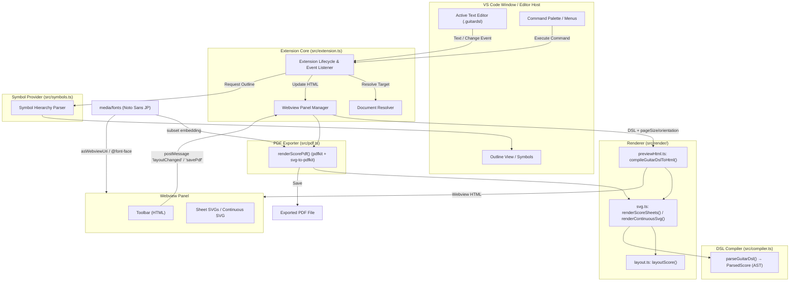
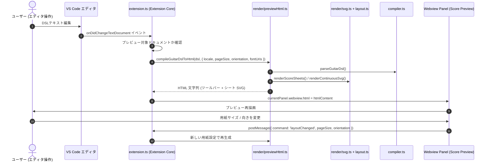
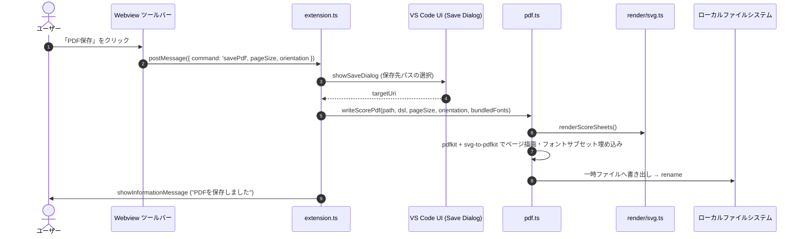
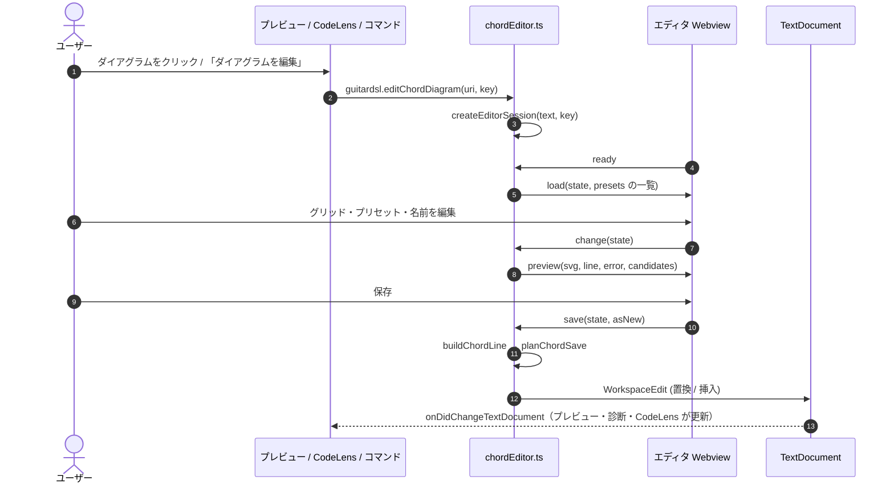
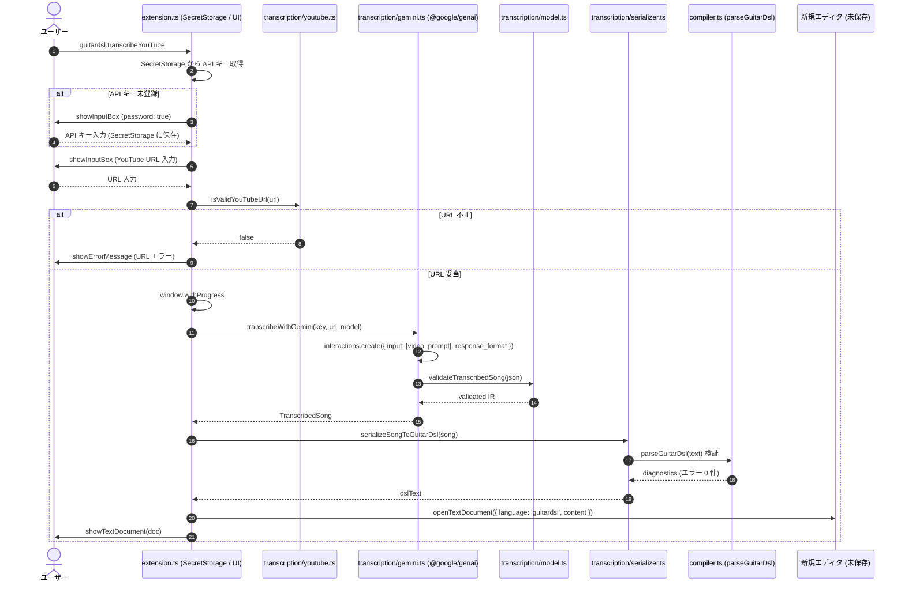

# 内部アーキテクチャ設計書 (Internal Architecture Design)

本書は、Visual Studio Code 拡張機能 **GuitarDSL Previewer** (`vscode-guitar-dsl`) の内部アーキテクチャ、コンポーネント構成、データフロー、および主要アルゴリズムを定義する設計ドキュメントである。

---

## 1. 全体アーキテクチャ概要 (Architecture Overview)

`vscode-guitar-dsl` は、エディタ機能の統合を担う **VS Code Extension Core**、DSL を AST に変換する **GuitarDSL Compiler**、AST からページ SVG / Webview HTML を生成する **Renderer**、SVG をベクター PDF に変換する **PDF Exporter**、およびアウトライン機能を提供する **Document Symbol Provider** から構成される。依存方向は `extension → pdf / render → compiler` であり、`compiler.ts` は描画モジュールに依存しない。

---

## 2. コンポーネント構成と責務 (Component Architecture)

### 2.1 Extension Core (`src/extension.ts`)
拡張機能のライフサイクル管理、イベント購読、Webviewパネルの制御、および外部ブラウザによるPDFエクスポートを統括する。

- **エントリポイント**:
  - `activate(context: vscode.ExtensionContext)`: コマンド、イベントリスナー、シンボルプロバイダの登録を行う。
  - `deactivate()`: 拡張機能終了時のリソース解放。
- **WebviewPanel シングルトン管理**:
  - プレビュー表示用パネル（`guitardslPreview`）は多重起動を防ぐため単一インスタンスとして保持。
  - `retainContextWhenHidden: true` を指定し、タブ切り替え時にプレビューのスクロール位置やDOM状態がリセットされるのを防ぐ。
  - パネル破棄イベント（`onDidDispose`）で参照をクリア。
- **ドキュメント解決 (`resolveGuitarDslDocument`)**:
  - コマンド引数の URI、現在のアクティブエディタ、表示中のエディタ群、最後にアクティブだった GuitarDSL ドキュメント、ワークスペース内の開いているファイルの優先順位で対象ドキュメントを安全に解決。
- **イベント駆動同期**:
  - `onDidChangeTextDocument`: テキストが編集された際、現在プレビュー対象のファイルと同一であれば即座に再描画（`compileGuitarDslToHtml`）を実行。
  - `onDidChangeActiveTextEditor`: ユーザが別の `.guitardsl` ファイルをアクティブにした際、プレビューの描画対象を自動追従。
- **プレビューの用紙設定**:
  - 用紙サイズ・向き（初期値 `A4` / 縦）を拡張機能ホスト側で保持する。Webview からの `layoutChanged` メッセージ（値は `isPageSize` / `isPageOrientation` で検証）で更新し、再描画する。Webview 側は表示モードのみを `vscode.setState` で保持する。
  - 同梱フォントを Webview で読み込むため、`localResourceRoots` に `media/fonts` を指定し、`asWebviewUri` で得た URI を `compileGuitarDslToHtml` に渡す。
- **PDFエクスポート制御 (`exportScoreToPdf`)**:
  - 保存ダイアログで保存先を選択させ、`writeScorePdf`（`src/pdf.ts`）を呼び出す。外部プロセスは起動しない。
- **診断 (`DiagnosticCollection('guitardsl')`)**:
  - GuitarDSL 文書の open / change 時に `parseGuitarDsl` を実行し、`ParsedScore.diagnostics` を `vscode.Diagnostic` に変換して発行する（プレビューの有無に依存しない）。close 時にクリアする。
  - 文言は `i18n.ts` の `formatDiagnostic(code, args, locale)` で生成する。コンパイラは文言を持たない。
- **コードダイアグラムエディタの入口**: `guitardsl.editChordDiagram` コマンド、`ChordDefinitionCodeLensProvider`、プレビューからの `editChord` メッセージを登録する（実体は §2.7）。

### 2.2 GuitarDSL Compiler (`src/compiler.ts`)
テキストとしてのDSL入力をパースし、楽譜の AST（`ParsedScore`）を構築する。描画処理は持たない。

- **データモデル**:
  - `ParsedScore`: パース済みの楽曲全体（メタデータ、使用コード一覧、ページ配列、スタイル情報）。
  - `ScorePage`: 手動改ページ（`pagebreak`）単位の小節の配列。
  - `MeasureData`: 1小節分のデータ（小節内コード配列 `chords`、反復記号 `repeatStart` / `repeatEnd` / `isMeasureRepeat`、リズム配列 `rhythms`、歌詞 `lyric`、セクション名 `sectionName` 等）。
  - `RhythmItem`: 個々のリズム要素（音価 `duration`、休符フラグ `isRest`、ピッキング `down` / `up`、ゴースト `ghost`、アクセント `accent`、タイ `tie`）。
  - `MelodyNote`: メロディ音符（音高 `pitch`、音価 `value` / 拍数 `beats`、休符、タイ、番ごとの音節 `syllables`）。`MeasureData.melody` に保持し、未定義はメロディなし。
  - `ParsedScore` の追加項目: 調号 `keySignature`（−7〜+7 / null）、`showRhythm`、`measuresPerRow`、`diagnostics`（行・列範囲・重大度・コード・引数）。
- **音価 (`src/duration.ts`)**: 共通音価表記（`項 (+ 項)*`、項 = 基本音価 + 付点 / 3連）を `parseNoteValue` で解析し、拍数を有理数 `Fraction` で返す。コード・メロディの `/` 形式とリズムトークンで共用し、小節の合計拍数の検算も有理数で行う。コード・メロディの `:` 形式（拍数）は `parseBeats` で有理数化する。`parseDurationToBeats` は互換ラッパー。
- **パーサー (`parseGuitarDsl`)**:
  - `mel:` / `lyr:` 行は小節行より先に判定する。メロディは「未割り当て小節カーソル」で小節へ割り当て、セクション見出し・改ページでカーソルを末尾へ進める。`lyr:` は直前の `mel:` 行が割り当てた音符列に番ごとに音節を割り当てる。
  - 構文上の問題は例外にせず `diagnostics` に積み、該当トークンを捨てて処理を継続する（§5）。
  - 行単位でテキストを走査。
  - ヘッダー部（`key: value`）から楽曲メタデータおよびスタイル指定を抽出。
  - セクション見出し（`[...]`）および改ページ指示（`pagebreak`）を認識し、ページ構造（`ScorePage`）を分割。
  - 小節行（`|` 区切り）を行分割・トークン分解し、コード、リズム（音価・ピッキング記号・タイ等）、歌詞（`l:"..."`）を構造化。
  - 使用されているコードを自動収集する。キーは `コード名` または `コード名@ラベル`（`ParsedScore.usedChords`）。`ChordPlacement.name` は表示名（ラベルなし）で、ラベルは `ChordPlacement.label` に分けて持つ。
  - `chord` 行はヘッダーより先に判定し、`ParsedScore.chordDefinitions` に集める（重複は先勝ち）。`@ラベル` 参照と定義の照合は全行の走査後に行うため、定義と参照の前後関係は問わない。
- **コード定義 (`src/chordDefinition.ts`)**: `chord` 行のモデル（`ChordVoicing` / `ChordDefinition`、弦インデックス 0 = 6 弦）、解析 `parseChordDefinition`（エラー理由コードを返し、例外にしない）、整形 `formatChordDefinition`（解析と往復で一致）、開始フレットの自動決定 `resolveBaseFret`、コード名パターン `CHORD_NAME_PATTERN`。コンパイラ・描画・エディタで共用し、VS Code API に依存しない。
- **コード理論 (`src/chordDetect.ts`)**: 標準チューニングの押弦からの自動判定 `detectChordNames`（ピッチクラス集合とタイプの照合、7th・9th 系の 5 度省略、最低音による分数コード、単純な名前ほど上位）と、コード名の分解 `parseChordName`。
- **プリセット (`src/chordPresets.ts`)**: 手書きの基本形 `CHORD_LIBRARY` と、CAGED 系の形テンプレートを 12 ルートへ平行移動したボイシング（`getPresetVoicings`）。手書き → 開放弦あり → 低いフレットの順に並べ、重複を除く。セーハは `inferBarres` で推定する。`getDefaultVoicing` がラベルなしコードの既定の押さえ方。

### 2.3 Renderer (`src/render/`)
AST からページ SVG と Webview HTML を生成する。VS Code API に依存しない純粋関数群。

- **`layout.ts`**:
  - 用紙定義（`PAGE_CONFIG`）と座標系。座標単位は pt（1/72 inch）で、シート SVG の `viewBox` は用紙サイズ（pt）と一致する。これにより同じ SVG が PDF ページへ 1:1 で対応する。
  - 余白（上下 10mm、左右 12mm）、横向き時の 2 カラム（ガター 12mm）。
  - 段（`measuresPerRow` 小節、既定 4）は幅 780 の段座標で描画し、カラム幅に合わせて `scale` する。段間隔も段座標（8）で持つため、用紙サイズによらず比率が一定。
  - 段の高さは `SystemRow.unitHeight` として段ごとに算出する。メロディのない段は 140（従来と同一）、メロディのある段はメロディ部（譜表・加線域・歌詞番数）を加えた高さ、リードシートモードのメロディ段はメロディ部のみ。
  - `layoutScore()`: 手動改ページごとに新ページを開始し、各段の高さを用いて残り高さに収まらない段を次ページへ送る（自動改ページ）。空ページでも最低 1 段は受け入れ、無限ループを防ぐ。縦向きは 1 ページ / シート、横向きは 2 ページ / シート。
  - `estimateTextWidth()`: 同梱フォントの ASCII 文字幅テーブル（実測値）と全角 = 1em による文字幅見積もり。拡張機能ホストには DOM が無いため、タイトルの縮小・省略判定に用いる。
- **`svg.ts`**:
  - `renderScoreSheets()`: シートごとの単一 SVG（ヘッダー、コードダイアグラム、段、ランニングヘッダー、フッター）。
  - `renderContinuousSvg()` / `compileGuitarDslToSvg()`: Web モード用のページ分割なしの縦長 SVG。
  - 段描画（`renderSystemSvgContent`）：五線、ト音記号、スラッシュ、符尾・ビーム、タイ、ストローク記号、小節線、歌詞。
  - メロディ段：メロディ譜表（調号、符頭、加線、臨時記号、符幹、連桁、3連括弧、タイ）と音節歌詞を上に描画し、既存のリズム描画を y 方向に平行移動して下に描画する。小節内の x 座標は、リズムとメロディの発音拍の和集合を等間隔に並べた列から決める（メロディのない小節は従来通りリズム項目の等間隔）。
  - 五線譜上のコード名は `notation.ts` の `renderChordName` で描く（リズム段とメロディ段で共用）。`@ラベル` は上付きの別 `<text>` として描き、戻り値の幅で次のコード名との間隔を決める。
  - 臨時記号の要否は調号と小節内の臨時記号状態から決める。♯・♭・♮ はフォントに依存しないベクターパスで描き、プレビューと PDF の同一性を保つ。
  - フォントはルート要素の `font-family`（同梱 Noto Sans JP）に統一し、要素ごとの `font-family` 指定は持たない。全テキストは `escapeXml` を通す。
- **`chordLibrary.ts`**: ダイアグラムの解決 `resolveChordDiagram` / `resolveScoreDiagrams`（ファイル内の定義 → ラベルなし定義 → プリセット → フォールバック）。
- **`chordDiagram.ts`**: 1 枚のダイアグラムの SVG（`renderChordDiagramSvg`、ダイアグラム単位座標）。楽譜ヘッダーとエディタのプレビュー・サムネイルで共用する。`notation.ts` → `layout.ts` の循環を避けるため `notation.ts` を import しない。
- **ダイアグラム領域**: `getDiagramGrid` は解決済みダイアグラムから、ラベル行と指番号行が要るかを判定してセル高さを決める。各セルは `<g class="chord-diagram" data-chord-key>` で、プレビューのクリック対象になる（PDF には影響しない属性）。
- **`chordEditorHtml.ts`**: コードダイアグラムエディタ Webview の静的な HTML（文言は JSON として埋め込む）。
- **`previewHtml.ts`** (`compileGuitarDslToHtml`):
  - ツールバー（HTML）とシート SVG 群・連続 SVG を包含する Webview HTML を構築する。表示モードは CSS（`data-display-mode`）で切り替える。
  - `fontUris` 指定時は `@font-face` で同梱フォントを読み込む。

### 2.4 PDF Exporter (`src/pdf.ts`)
- `renderScorePdf()`: `renderScoreSheets()` の SVG を `svg-to-pdfkit` で pdfkit のページへ描画する（1 シート = 1 ページ、ベクター）。
- フォントは同梱の Noto Sans JP Regular / Bold を登録し、`fontCallback` で太字（`font-weight` 600 以上）と通常を切り替える。pdfkit が使用グリフのみをサブセット埋め込みする。
- フォント読み込みは描画前に明示的に行う（svg-to-pdfkit はフォント読み込み失敗時に警告のみで Helvetica へ切り替えるため、そのままでは文字化けした PDF が生成されてしまう）。
- `writeScorePdf()`: 一時ファイルに書き出してから `rename` し、失敗時に不完全なファイルを残さない。
- VS Code API に依存しないため、単体テストで PDF 生成を検証できる。

### 2.5 Document Symbol Provider (`src/symbols.ts`)
VS Codeの「アウトライン」機能およびシンボル検索と連携し、DSLドキュメントの構造ツリーを構築する。

- **`GuitarDslDocumentSymbolProvider`**:
  - `vscode.DocumentSymbolProvider` インターフェースを実装。
  - ドキュメントをスキャンし、最上位にメタデータプロパティ（`title`, `artist`, `key`, `bpm` 等: `SymbolKind.Property`）を配置。
  - 各セクション（`[Intro]`, `[Aメロ]` 等）を `SymbolKind.Namespace` として登録し、そのセクション内の小節行の終了行までを行範囲（`range`）として確定。
  - セクション配下の小節行を `formatMeasureSummary` により要約文字列（例: `| C G | Am Em |`）に変換し、子シンボル（`SymbolKind.Field`）として階層的に追加。

### 2.6 TextMate 構文定義 (`syntaxes/guitardsl.tmLanguage.json`)
VS Codeのエディタコアにおけるリアルタイムな字句ハイライトを行う。

- 正規表現による高速なパターンマッチング。
- セクション見出し、メタデータヘッダー、小節線、反復記号、コードネーム、リズムストローク記号、歌詞トークンを標準的なスコープ名へマッピング。
- `chord` 定義行は `begin` / `end` の領域として、コード名・ラベル・フレット文字列・オプションを個別にマッピングする。

### 2.7 コードダイアグラムエディタ (`src/chordEditor.ts`, `src/chordEditorModel.ts`, `media/chordEditor.js`)
- **責務の分担**: 検証・描画・自動判定・保存は拡張機能ホストが行い、Webview のスクリプト（`media/chordEditor.js`、ビルド対象外の素の JS）は編集状態の操作と表示だけを行う。ビルドは tsc のみのため、Webview 用のバンドルは作らず、TS のロジックはメッセージ経由で使う。
- **`chordEditorModel.ts`**（VS Code 非依存、単体テスト対象）: 編集状態 `ChordEditorState`（`windowBase` = グリッドの開始フレット）、`createEditorSession`（既存定義またはキーの解決結果から開始）、`buildChordLine`（整形してから解析し直して検証。開始フレットは自動値と違うときだけ `base:` にする）、`planChordSave`（置換・挿入位置・重複の判定）。
- **`ChordEditorPanel`**: シングルトン。開いた文書の URI と編集中の行番号を保持する。保存時は文書を開き直し、編集中の行がまだ `chord` 行であることを確かめてから `WorkspaceEdit` を適用し、保存後に解析し直して行番号を更新する。Webview からの状態は `sanitizeState` で形を整えてから使う。
- **`ChordDefinitionCodeLensProvider`**: 解析に成功した `chord` 行ごとに CodeLens を返す。
- **メッセージ**:

| 方向 | メッセージ | 内容 |
|---|---|---|
| Webview → Ext | `ready` | 初期化完了。Ext は `load` を返す |
| Webview → Ext | `change` | 編集状態。Ext は `preview`（SVG、DSL 行、エラー、判定候補）を返す |
| Webview → Ext | `presets` | ルートとタイプ。Ext は `presets`（状態と SVG の一覧）を返す |
| Webview → Ext | `save` / `close` | 保存（`asNew`）、パネルを閉じる |
| Ext → Webview | `status` | 保存結果・エラー、編集中表示 |

### 2.8 YouTube 採譜サブシステム (`src/transcription/`)
Gemini API の動画理解機能を介して YouTube 音源から構造化 Music IR を抽出し、決定論的に GuitarDSL へ変換する独立モジュール群。VS Code 拡張機能コア以外（コンパイラ・レンダラ・PDF）からは独立し、Gemini SDK はこのサブシステム内に隠蔽される。

- **`model.ts`**:
  - Music IR v1 のデータモデル（`TranscribedSong`, `Section`, `Measure`, `ChordEvent`, `RhythmEvent`, `MelodyEvent`）。カポ（`capo`）、小節歌詞（`lyrics`）、およびメロディ音符ごとの音節歌詞（`lyric`）をサポート。
  - Gemini Structured Output 用の JSON Schema（`MUSIC_IR_JSON_SCHEMA`）。
  - 純粋なセマンティックバリデーション（`validateTranscribedSong`）：BPM 30..300、キー・コード・ピッチの構文適合性、4/4 拍子限定、各小節内合計 4 拍の厳密一致（`duration.ts` の有理数検証）。不正データはシリアライザへ渡さず排除。
- **`youtube.ts`**:
  - YouTube URL の形式検証（`isValidYouTubeUrl`）および ID 抽出等の純粋ヘルパー関数群。
  - HTTPS かつ `youtube.com` / `www.youtube.com` / `youtu.be` のみを許可。
- **`gemini.ts`**:
  - `@google/genai` の `interactions.create` を用いた Gemini アダプタ。
  - 固定プロンプト（全セクション・全小節の完全書き起こし、推奨カポ設定、音節歌詞の指定を含む）、YouTube 動画 URI（`{ type: "video", uri }`）、および Music IR JSON Schema を指定してリクエストを送信。
  - レスポンスのテキスト抽出、JSON パース、および `model.ts` によるセマンティック検証を実行。API キーや生レスポンスはログ出力しない。
- **`serializer.ts`**:
  - バリデーション済み Music IR を決定論的な GuitarDSL テキストへ変換（`serializeSongToGuitarDsl`）。VS Code 非依存。
  - 前小節と同一パターンの繰り返しにおける `%`（小節リピート）記法や `mel: | % |` の活用、メロディ音符ごとの音節歌詞（`lyr:`）の出力をサポート。
  - 同一 IR から常に同一の文字列を出力。
  - シリアライズ直後に `parseGuitarDsl` を呼び出し、エラー診断が 0 件であることを確認。

---

## 3. データフローとメッセージング (Data & Event Flow)

### 3.1 リアルタイムプレビュー更新フロー

### 3.2 PDFエクスポートフロー

### 3.3 コードダイアグラム編集フロー

### 3.4 YouTube 自動採譜フロー

---

## 4. ページネーションとレイアウト設計 (Pagination & Layout Design)

### 4.1 ページ分割ロジック
- **手動改ページ**: パーサーが `pagebreak` で `ScorePage` を分割し、レイアウトは各 `ScorePage` の先頭で新しいページを開始する。
- **自動改ページ**: `layoutScore()` がページの残り高さ（カラム高さ − ヘッダー / ランニングヘッダー − フッター）を追跡し、次の段が収まらなければ新しいページを開始する。
- **ヘッダー描画**: 1ページ目にはタイトル、アーティスト、メタデータ、およびコードダイアグラムを描画し、2ページ目以降はランニングヘッダーを描画する。
- **ページ番号**: 自動改ページ後の物理ページ番号（`LayoutPage.pageNumber`）を用いる。

### 4.2 プレビュー表示モード (View Modes)
- **Single Page (1ページ)**: シート SVG を縦に並べる。
- **Spread (見開き)**: シート SVG を 2 枚ずつ横に並べる。
- **Web**: 連続 SVG を表示する。
- 各 SVG は `width: 100%` で表示幅に合わせて縮小し、`max-width` は用紙の実寸（96dpi 換算）とする。

### 4.3 プレビューと PDF の同一性
- プレビューと PDF はどちらも `renderScoreSheets()` の出力を用い、フォントも同梱 Noto Sans JP に統一する。
- 旧来のブラウザ印刷用 HTML（`@page` CSS）は廃止した。

---

## 5. エラーハンドリングと堅牢性 (Error Handling & Robustness)

1. **構文エラーの自己回復性**:
   - DSLパーサーは、未知のトークンや構文違反に遭遇しても処理を中断（throw）せず、安全にフォールバック（小節のスキップ、プレースホルダー表示、デフォルト値の適用）を行い、プレビュー描画がクラッシュするのを防ぐ。
   - メロディ・歌詞・音価・新ヘッダーの問題は `ParsedScore.diagnostics` に記録し、拡張機能ホストが VS Code の診断として表示する。
2. **環境非依存の PDF 出力**:
   - PDF 生成は拡張機能内（pdfkit）で完結し、外部ブラウザや OS のフォントに依存しない。
3. **失敗時のファイル整合性**:
   - PDF は一時ファイルに書き出した後で `rename` する。フォント読み込みや書き込みに失敗した場合は一時ファイルを削除し、エラーを通知する。
4. **Webview メッセージの検証**:
   - `layoutChanged` / `savePdf` の `pageSize` / `orientation` は型ガードで検証し、不正値は現在値で置き換える。
5. **YouTube 採譜における機密保護と堅牢性**:
   - API キーは `ExtensionContext.secrets`（`guitardsl.geminiApiKey`）にのみ安全に保存し、VS Code settings やログには一切出力・永続化しない。
   - YouTube URL は HTTPS かつ許可ドメイン（`youtube.com` / `www.youtube.com` / `youtu.be`）以外を API 呼び出し前に遮断する。
   - モデルの生レスポンスやスタックトレースはログ出力・通知せず、分類された簡潔なエラーメッセージのみを表示する。
   - URL 不正、API エラー、バリデーション失敗時はいかなるドキュメントも生成せず、既存ファイルやエディタを一切変更しない。

---

## 6. 国際化・ローカライゼーション設計 (Internationalization Architecture)

### 6.1 モジュール構成 (`src/i18n.ts`)
- **責務**:
  - 対応ロケール（`'ja' | 'en'`）の型定義。
  - VS Code ロケール文字列（例: `'ja'`, `'ja-JP'`, `'en'`, `'en-US'`, `'fr'` 等）を受け取り、日本語プレフィックス以外をすべて `'en'` に縮退解決する `resolveLocale` 関数。
  - ホストメッセージおよびWebviewツールバーUIメッセージの型定義（`Messages`）および静的辞書（`MESSAGES_JA`, `MESSAGES_EN`）の提供。
  - 解決されたロケールに応じたメッセージ辞書を取得する `getMessages` ヘルパー。

### 6.2 拡張機能ホストとプレビューHTMLの連携
- **拡張機能ホスト (`src/extension.ts`)**:
  - `vscode.env.language` からロケールを判別。
  - 保存ダイアログ、通知メッセージ（情報/警告/エラー）、アクションボタンをローカライズ。
  - `updateWebview` 実行時に解決済みロケールを `compileGuitarDslToHtml(dsl, { locale, ... })` に渡す。
- **プレビュー HTML ビルダー (`src/render/previewHtml.ts`)**:
  - `compileGuitarDslToHtml` はオプション引数 `{ locale?: string }` を受け取り、内部で `resolveLocale` を呼び出してメッセージ辞書を取得。
  - ツールバーの各ボタンテキスト（1ページ / Single Page、見開き / Spread、Web / Web）、用紙設定ラベル、向き切替ラベル、PDF保存ボタン、および各ボタンのツールチップ（title 属性）を動的に差し替えてレンダリング。
  - オプション未指定時のデフォルト動作は英語（`'en'`）とし、外部呼び出し・単体テストとの後方互換性を保証。
- **VS Code マニフェスト (`package.json`, `package.nls.json`, `package.nls.ja.json`)**:
  - コマンドタイトルを `%command.showPreview.title%` / `%command.exportPdf.title%` に置換し、VS Code プラットフォーム標準の NLS 機構と完全連動。

