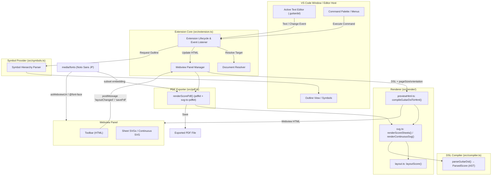
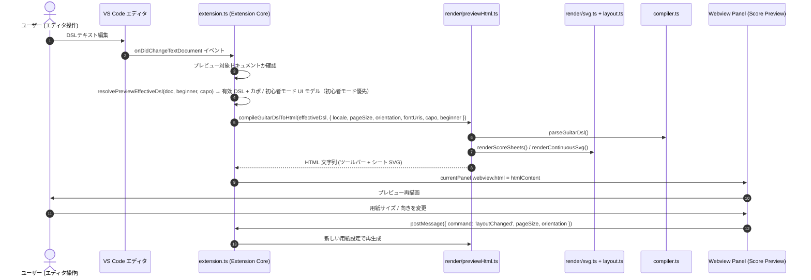
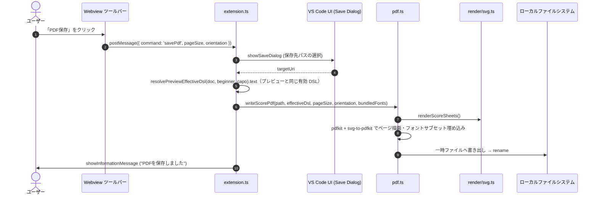
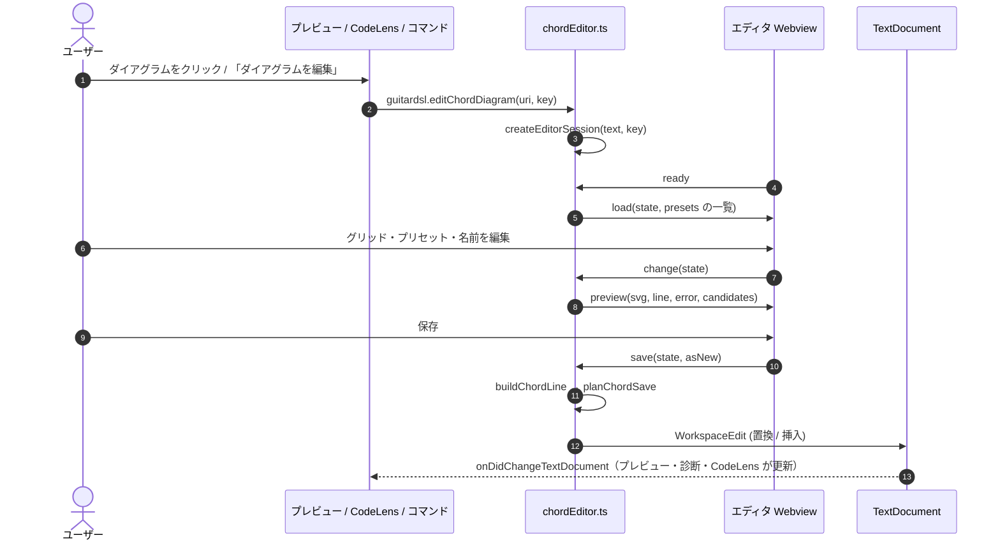
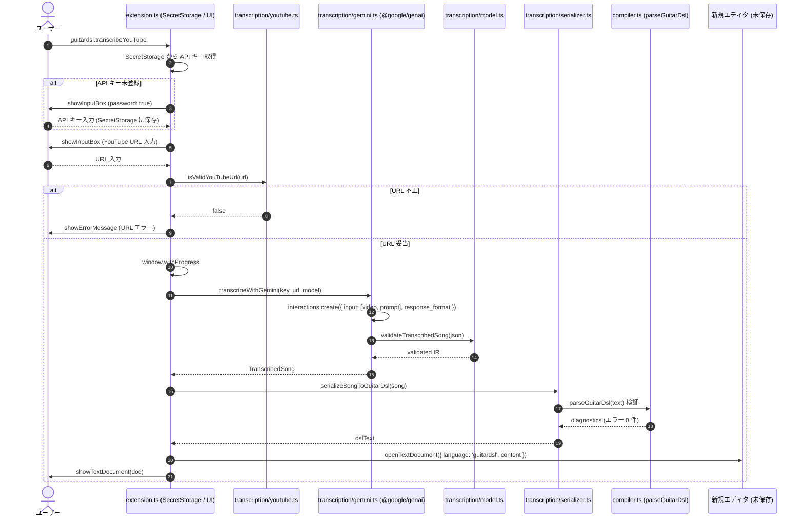

# 内部アーキテクチャ設計書 (Internal Architecture Design)

本書は、Visual Studio Code 拡張機能 **GuitarDSL Previewer** (`vscode-guitar-dsl`) の内部アーキテクチャ、コンポーネント構成、データフロー、および主要アルゴリズムを定義する設計ドキュメントである。

---

## 1. 全体アーキテクチャ概要 (Architecture Overview)

`vscode-guitar-dsl` は、エディタ機能の統合を担う **VS Code Extension Core**、DSL を AST に変換する **GuitarDSL Compiler**、AST からページ SVG / Webview HTML を生成する **Renderer**、SVG をベクター PDF に変換する **PDF Exporter**、およびアウトライン機能を提供する **Document Symbol Provider** から構成される。依存方向は `extension → pdf / render → compiler` であり、`compiler.ts` は描画モジュールに依存しない。

---

## 2. コンポーネント構成と責務 (Component Architecture)

### 2.1 Extension Core (`src/extension.ts`)
拡張機能のライフサイクル管理、イベント購読、Webviewパネルの制御、および外部ブラウザによるPDFエクスポートを統括する。

- **エントリポイント**:
  - `activate(context: vscode.ExtensionContext)`: コマンド、イベントリスナー、シンボルプロバイダの登録を行う。
  - `deactivate()`: 拡張機能終了時のリソース解放。
- **WebviewPanel シングルトン管理**:
  - プレビュー表示用パネル（`guitardslPreview`）は多重起動を防ぐため単一インスタンスとして保持。
  - `retainContextWhenHidden: true` を指定し、タブ切り替え時にプレビューのスクロール位置やDOM状態がリセットされるのを防ぐ。
  - パネル破棄イベント（`onDidDispose`）で参照をクリア。
- **ドキュメント解決 (`resolveGuitarDslDocument`)**:
  - コマンド引数の URI、現在のアクティブエディタ、表示中のエディタ群、最後にアクティブだった GuitarDSL ドキュメント、ワークスペース内の開いているファイルの優先順位で対象ドキュメントを安全に解決。
- **イベント駆動同期**:
  - `onDidChangeTextDocument`: テキストが編集された際、現在プレビュー対象のファイルと同一であれば即座に再描画（`compileGuitarDslToHtml`）を実行。
  - `onDidChangeActiveTextEditor`: ユーザが別の `.guitardsl` ファイルをアクティブにした際、プレビューの描画対象を自動追従。
- **プレビューの用紙設定**:
  - 用紙サイズ・向き（初期値 `A4` / 縦）を拡張機能ホスト側で保持する。Webview からの `layoutChanged` メッセージ（値は `isPageSize` / `isPageOrientation` で検証）で更新し、再描画する。Webview 側は表示モードのみを `vscode.setState` で保持する。
  - 同梱フォントを Webview で読み込むため、`localResourceRoots` に `media/fonts` を指定し、`asWebviewUri` で得た URI を `compileGuitarDslToHtml` に渡す。
- **PDFエクスポート制御 (`exportScoreToPdf`)**:
  - 保存ダイアログで保存先を選択させ（`options.targetUri` があれば省略）、`writeScorePdf`（`src/pdf.ts`）を呼び出す。外部プロセスは起動しない。
  - 描画する DSL は `options.dslContentOverride ?? doc.getText()`。プレビューの PDF 保存と `guitardsl.exportPdf` はどちらも `resolvePreviewEffectiveDsl(doc, beginner, capo).text`（§2.11）を渡すため、プレビューと同じ有効 DSL が使われる。
- **プレビューのカポ一時変更・初心者モード**: `PreviewCapoController`（§2.10）と `PreviewBeginnerController`（§2.11）を 1 つずつ持つ。`updateWebview` は `resolvePreviewEffectiveDsl(doc, beginner, capo)`（初心者モードが有効ならそれを優先）の有効 DSL・カポ UI モデル・初心者モード UI モデルを `compileGuitarDslToHtml` に渡す。Webview からの `capoChanged` / `applyCapo` / `editCapo` / `beginnerToggled` / `barrePolicyChanged` を受け（初心者モード中の `capoChanged` / `applyCapo` は初心者モードへ振り分ける）、プレビュー破棄・対象ドキュメントのクローズ・別ドキュメントへの切り替えで両方の状態を解除する。
- **診断 (`DiagnosticCollection('guitardsl')`)**:
  - GuitarDSL 文書の open / change 時に `parseGuitarDsl` を実行し、`ParsedScore.diagnostics` を `vscode.Diagnostic` に変換して発行する（プレビューの有無に依存しない）。close 時にクリアする。
  - 文言は `i18n.ts` の `formatDiagnostic(code, args, locale)` で生成する。コンパイラは文言を持たない。
- **コードダイアグラムエディタの入口**: `guitardsl.editChordDiagram` コマンド、`ChordDefinitionCodeLensProvider`、プレビューからの `editChord` メッセージを登録する（実体は §2.7）。

### 2.2 GuitarDSL Compiler (`src/compiler.ts`)
テキストとしてのDSL入力をパースし、楽譜の AST（`ParsedScore`）を構築する。描画処理は持たない。

- **データモデル**:
  - `ParsedScore`: パース済みの楽曲全体（メタデータ、使用コード一覧、ページ配列、スタイル情報）。
  - `ScorePage`: 手動改ページ（`pagebreak`）単位の小節の配列。
  - `MeasureData`: 1小節分のデータ（小節内コード配列 `chords`、反復記号 `repeatStart` / `repeatEnd` / `isMeasureRepeat`、リズム配列 `rhythms`、歌詞 `lyric`、セクション名 `sectionName` 等）。
  - `RhythmItem`: 個々のリズム要素（音価 `duration`、休符フラグ `isRest`、ピッキング `down` / `up`、ゴースト `ghost`、アクセント `accent`、タイ `tie`）。
  - `MelodyNote`: メロディ音符（音高 `pitch`、音価 `value` / 拍数 `beats`、休符、タイ、番ごとの音節 `syllables`）。`MeasureData.melody` に保持し、未定義はメロディなし。
  - `ParsedScore` の追加項目: 調号 `keySignature`（−7〜+7 / null）、`showRhythm`、`measuresPerRow`、`diagnostics`（行・列範囲・重大度・コード・引数）。
  - `originalKey` / `bpm` / `keySignature` は**冒頭の**メタデータ（最後に見たイベントではない）。冒頭の拍子 `timeSignature`、フィール `feel`、弱起 `pickup?`、スコアイベント列 `events` を持つ（§2.12）。
  - `MeasureData` は `measureIndex`（全体での 0 始まり）、解決済みのコンテキスト `context: ResolvedMeasureContext`、その小節の直前に適用されるイベント `eventsBefore`、期待する長さ `expectedBeats`、`isPickup?` を持つ。描画はこれだけを参照し、DSL のイベント行を読み直さない。
  - ソース位置（ソースを保ったまま書き換える処理用。描画には使わない）: `chordTokens`（小節行に書かれた各コードトークンの行とコード名部分の列範囲。`@ラベル`・長さ指定は含まない。`%` の繰り返しは含まない）、`headerLines`（ヘッダー行のキーと値の列範囲。値の範囲は行末コメント（空白 + `#` 以降）を含まない）、`firstBodyLine`（最初のセクション・小節・`mel:`/`lyr:`・改ページ行）。コードトークンの列は、トークンの前後が空白・`|`・`:`（後ろは `]` も）である位置を探すため、`l:"..."` 内の同じ文字列には一致しない。採用した位置の直後から次のトークンを探すので、同じ小節の同名コード（`| l:"C" C C |`）はそれぞれ別の範囲になる。
- **音価 (`src/duration.ts`)**: 共通音価表記（`項 (+ 項)*`、項 = 基本音価 + 付点 / 連符比）を `parseNoteValue` で解析し、拍数を有理数 `Fraction` で返す。コード・メロディの `/` 形式とリズムトークンで共用し、小節の合計拍数の検算も有理数で行う。コード・メロディの `:` 形式（拍数）は `parseBeats` で有理数化する。`parseDurationToBeats` は互換ラッパー。
- **パーサー (`parseGuitarDsl`)**:
  - `mel:` / `lyr:` 行は小節行より先に判定する。メロディは「未割り当て小節カーソル」で小節へ割り当て、セクション見出し・改ページでカーソルを末尾へ進める。`lyr:` は直前の `mel:` 行が割り当てた音符列に番ごとに音節を割り当てる。
  - 構文上の問題は例外にせず `diagnostics` に積み、該当トークンを捨てて処理を継続する（§5）。
  - 行単位でテキストを走査。
  - ヘッダー部（`key: value`）から楽曲メタデータおよびスタイル指定を抽出。
  - セクション見出し（`[...]`）および改ページ指示（`pagebreak`）を認識し、ページ構造（`ScorePage`）を分割。
  - 小節行（`|` 区切り）を行分割・トークン分解し、コード、リズム（音価・ピッキング記号・タイ等）、歌詞（`l:"..."`）を構造化。
  - 使用されているコードを自動収集する。キーは `コード名` または `コード名@ラベル`（`ParsedScore.usedChords`）。`ChordPlacement.name` は表示名（ラベルなし）で、ラベルは `ChordPlacement.label` に分けて持つ。
  - `chord` 行はヘッダーより先に判定し、`ParsedScore.chordDefinitions` に集める（重複は先勝ち）。`@ラベル` 参照と定義の照合は全行の走査後に行うため、定義と参照の前後関係は問わない。
- **コード定義 (`src/chordDefinition.ts`)**: `chord` 行のモデル（`ChordVoicing` / `ChordDefinition`、弦インデックス 0 = 6 弦）、解析 `parseChordDefinition`（エラー理由コードを返し、例外にしない）、整形 `formatChordDefinition`（解析と往復で一致）、開始フレットの自動決定 `resolveBaseFret`、コード名パターン `CHORD_NAME_PATTERN`。コンパイラ・描画・エディタで共用し、VS Code API に依存しない。
- **コード理論 (`src/chordDetect.ts`)**: 標準チューニングの押弦からの自動判定 `detectChordNames`（ピッチクラス集合とタイプの照合、7th・9th 系の 5 度省略、最低音による分数コード、単純な名前ほど上位）と、コード名の分解 `parseChordName`。
- **プリセット (`src/chordPresets.ts`)**: 手書きの基本形 `CHORD_LIBRARY` と、CAGED 系の形テンプレートを 12 ルートへ平行移動したボイシング（`getPresetVoicings`）。手書き → 開放弦あり → 低いフレットの順に並べ、重複を除く。セーハは `inferBarres` で推定する。`getDefaultVoicing` がラベルなしコードの既定の押さえ方。

### 2.3 Renderer (`src/render/`)
AST からページ SVG と Webview HTML を生成する。VS Code API に依存しない純粋関数群。

- **`layout.ts`**:
  - 用紙定義（`PAGE_CONFIG`）と座標系。座標単位は pt（1/72 inch）で、シート SVG の `viewBox` は用紙サイズ（pt）と一致する。これにより同じ SVG が PDF ページへ 1:1 で対応する。
  - 余白（上下 10mm、左右 12mm）、横向き時の 2 カラム（ガター 12mm）。
  - 段（`measuresPerRow` 小節、既定 4）は幅 780 の段座標で描画し、カラム幅に合わせて `scale` する。段間隔も段座標（8）で持つため、用紙サイズによらず比率が一定。
  - 段の高さは `SystemRow.unitHeight` として段ごとに算出する。メロディのない段は 140（従来と同一）、メロディのある段はメロディ部（譜表・加線域・歌詞番数）を加えた高さ、リードシートモードのメロディ段はメロディ部のみ。
  - `layoutScore()`: 手動改ページごとに新ページを開始し、各段の高さを用いて残り高さに収まらない段を次ページへ送る（自動改ページ）。空ページでも最低 1 段は受け入れ、無限ループを防ぐ。縦向きは 1 ページ / シート、横向きは 2 ページ / シート。
  - `estimateTextWidth()`: 同梱フォントの ASCII 文字幅テーブル（実測値）と全角 = 1em による文字幅見積もり。拡張機能ホストには DOM が無いため、タイトルの縮小・省略判定に用いる。
- **`svg.ts`**:
  - `renderScoreSheets()`: シートごとの単一 SVG（ヘッダー、コードダイアグラム、段、ランニングヘッダー、フッター）。
  - `renderContinuousSvg()` / `compileGuitarDslToSvg()`: Web モード用のページ分割なしの縦長 SVG。
  - 段描画（`renderSystemSvgContent`）：五線、ト音記号、スラッシュ、符尾・ビーム、タイ、ストローク記号、小節線、歌詞。
  - メロディ段：メロディ譜表（調号、符頭、加線、臨時記号、符幹、連桁、3連括弧、タイ）と音節歌詞を上に描画し、既存のリズム描画を y 方向に平行移動して下に描画する。小節内の x 座標は、リズムとメロディの発音拍の和集合を等間隔に並べた列から決める（メロディのない小節は従来通りリズム項目の等間隔）。
  - 五線譜上のコード名は `notation.ts` の `renderChordName` で描く（リズム段とメロディ段で共用）。`@ラベル` は上付きの別 `<text>` として描き、戻り値の幅で次のコード名との間隔を決める。
  - 臨時記号の要否は調号と小節内の臨時記号状態から決める。♯・♭・♮ はフォントに依存しないベクターパスで描き、プレビューと PDF の同一性を保つ。
  - フォントはルート要素の `font-family`（同梱 Noto Sans JP）に統一し、要素ごとの `font-family` 指定は持たない。全テキストは `escapeXml` を通す。
- **`chordLibrary.ts`**: ダイアグラムの解決 `resolveChordDiagram` / `resolveScoreDiagrams`（ファイル内の定義 → ラベルなし定義 → プリセット → フォールバック）。
- **`chordDiagram.ts`**: 1 枚のダイアグラムの SVG（`renderChordDiagramSvg`、ダイアグラム単位座標）。楽譜ヘッダーとエディタのプレビュー・サムネイルで共用する。`notation.ts` → `layout.ts` の循環を避けるため `notation.ts` を import しない。
- **ダイアグラム領域**: `getDiagramGrid` は解決済みダイアグラムから、ラベル行と指番号行が要るかを判定してセル高さを決める。各セルは `<g class="chord-diagram" data-chord-key>` で、プレビューのクリック対象になる（PDF には影響しない属性）。
- **`chordEditorHtml.ts`**: コードダイアグラムエディタ Webview の静的な HTML（文言は JSON として埋め込む）。
- **`previewHtml.ts`** (`compileGuitarDslToHtml`):
  - ツールバー（HTML）とシート SVG 群・連続 SVG を包含する Webview HTML を構築する。表示モードは CSS（`data-display-mode`）で切り替える。
  - `fontUris` 指定時は `@font-face` で同梱フォントを読み込む。

### 2.4 PDF Exporter (`src/pdf.ts`)
- `renderScorePdf()`: `renderScoreSheets()` の SVG を `svg-to-pdfkit` で pdfkit のページへ描画する（1 シート = 1 ページ、ベクター）。
- フォントは同梱の Noto Sans JP Regular / Bold を登録し、`fontCallback` で太字（`font-weight` 600 以上）と通常を切り替える。pdfkit が使用グリフのみをサブセット埋め込みする。
- フォント読み込みは描画前に明示的に行う（svg-to-pdfkit はフォント読み込み失敗時に警告のみで Helvetica へ切り替えるため、そのままでは文字化けした PDF が生成されてしまう）。
- `writeScorePdf()`: 一時ファイルに書き出してから `rename` し、失敗時に不完全なファイルを残さない。
- VS Code API に依存しないため、単体テストで PDF 生成を検証できる。

### 2.5 Document Symbol Provider (`src/symbols.ts`)
VS Codeの「アウトライン」機能およびシンボル検索と連携し、DSLドキュメントの構造ツリーを構築する。

- **`GuitarDslDocumentSymbolProvider`**:
  - `vscode.DocumentSymbolProvider` インターフェースを実装。
  - ドキュメントをスキャンし、最上位にメタデータプロパティ（`title`, `artist`, `key`, `bpm` 等: `SymbolKind.Property`）を配置。
  - 各セクション（`[Intro]`, `[Aメロ]` 等）を `SymbolKind.Namespace` として登録し、そのセクション内の小節行の終了行までを行範囲（`range`）として確定。
  - セクション配下の小節行を `formatMeasureSummary` により要約文字列（例: `| C G | Am Em |`）に変換し、子シンボル（`SymbolKind.Field`）として階層的に追加。

### 2.6 TextMate 構文定義 (`syntaxes/guitardsl.tmLanguage.json`)
VS Codeのエディタコアにおけるリアルタイムな字句ハイライトを行う。

- 正規表現による高速なパターンマッチング。
- セクション見出し、メタデータヘッダー、小節線、反復記号、コードネーム、リズムストローク記号、歌詞トークンを標準的なスコープ名へマッピング。
- `chord` 定義行は `begin` / `end` の領域として、コード名・ラベル・フレット文字列・オプションを個別にマッピングする。

### 2.7 コードダイアグラムエディタ (`src/chordEditor.ts`, `src/chordEditorModel.ts`, `media/chordEditor.js`)
- **責務の分担**: 検証・描画・自動判定・保存は拡張機能ホストが行い、Webview のスクリプト（`media/chordEditor.js`、ビルド対象外の素の JS）は編集状態の操作と表示だけを行う。ビルドは tsc のみのため、Webview 用のバンドルは作らず、TS のロジックはメッセージ経由で使う。
- **`chordEditorModel.ts`**（VS Code 非依存、単体テスト対象）: 編集状態 `ChordEditorState`（`windowBase` = グリッドの開始フレット）、`createEditorSession`（既存定義またはキーの解決結果から開始）、`buildChordLine`（整形してから解析し直して検証。開始フレットは自動値と違うときだけ `base:` にする）、`planChordSave`（置換・挿入位置・重複の判定）。
- **`ChordEditorPanel`**: シングルトン。開いた文書の URI と編集中の行番号を保持する。保存時は文書を開き直し、編集中の行がまだ `chord` 行であることを確かめてから `WorkspaceEdit` を適用し、保存後に解析し直して行番号を更新する。Webview からの状態は `sanitizeState` で形を整えてから使う。
- **`ChordDefinitionCodeLensProvider`**: 解析に成功した `chord` 行ごとに CodeLens を返す。
- **メッセージ**:

| 方向 | メッセージ | 内容 |
|---|---|---|
| Webview → Ext | `ready` | 初期化完了。Ext は `load` を返す |
| Webview → Ext | `change` | 編集状態。Ext は `preview`（SVG、DSL 行、エラー、判定候補）を返す |
| Webview → Ext | `presets` | ルートとタイプ。Ext は `presets`（状態と SVG の一覧）を返す |
| Webview → Ext | `save` / `close` | 保存（`asNew`）、パネルを閉じる |
| Ext → Webview | `status` | 保存結果・エラー、編集中表示 |

### 2.8 YouTube 採譜サブシステム (`src/transcription/`)
Gemini API の動画理解機能を介して YouTube 音源から構造化 Music IR を抽出し、決定論的に GuitarDSL へ変換する独立モジュール群。VS Code 拡張機能コア以外（コンパイラ・レンダラ・PDF）からは独立し、Gemini SDK はこのサブシステム内に隠蔽される。

- **`model.ts`**:
  - Music IR v1 のデータモデル（`TranscribedSong`, `Section`, `Measure`, `ChordEvent`, `RhythmEvent`, `MelodyEvent`）。カポ（`capo`）、小節歌詞（`lyrics`）、およびメロディ音符ごとの音節歌詞（`lyric`）をサポート。
  - Gemini Structured Output 用の JSON Schema（`MUSIC_IR_JSON_SCHEMA`）。
  - 純粋なセマンティックバリデーション（`validateTranscribedSong`）：BPM 30..300、キー・コード・ピッチの構文適合性、4/4 拍子限定、各小節内合計 4 拍の厳密一致（`duration.ts` の有理数検証）。不正データはシリアライザへ渡さず排除。
- **`youtube.ts`**:
  - YouTube URL の形式検証（`isValidYouTubeUrl`）および ID 抽出等の純粋ヘルパー関数群。
  - HTTPS かつ `youtube.com` / `www.youtube.com` / `youtu.be` のみを許可。
- **`gemini.ts`**:
  - `@google/genai` の `interactions.create` を用いた Gemini アダプタ。
  - 固定プロンプト（全セクション・全小節の完全書き起こし、推奨カポ設定、音節歌詞の指定を含む）、YouTube 動画 URI（`{ type: "video", uri }`）、および Music IR JSON Schema を指定してリクエストを送信。
  - レスポンスのテキスト抽出、JSON パース、および `model.ts` によるセマンティック検証を実行。API キーや生レスポンスはログ出力しない。
- **`serializer.ts`**:
  - バリデーション済み Music IR を決定論的な GuitarDSL テキストへ変換（`serializeSongToGuitarDsl`）。VS Code 非依存。
  - 前小節と同一パターンの繰り返しにおける `%`（小節リピート）記法や `mel: | % |` の活用、メロディ音符ごとの音節歌詞（`lyr:`）の出力をサポート。
  - 同一 IR から常に同一の文字列を出力。
  - シリアライズ直後に `parseGuitarDsl` を呼び出し、エラー診断が 0 件であることを確認。

### 2.9 ローカル Audio MIR サブシステム（実験的）(`wasm/crates/audio-mir/`, `src/audioMir/`)
ローカルの PCM WAV からコード進行とストローク位置を推定する。仕様は spec §3.8 を参照。Gemini 採譜（§2.8）とはコードを共有せず、共有するのは Music IR（`TranscribedSong`）、`validateTranscribedSong`、`serializeSongToGuitarDsl` だけである。

- **Rust/WASM コア**（Cargo ワークスペース `wasm/`、クレート `wasm/crates/audio-mir/`）:
  - 依存は `wasm-bindgen`、`serde`/`serde_json`、`hound`、`rustfft`、`tract-onnx`（版を固定。wasm32 のビルドに `getrandom-js` 機能が必要）に限る。
  - `wasm-pack --target nodejs` でビルドし、生成物（CommonJS グルーと `.wasm`）を `media/audio-mir-wasm/` に出力する。この生成物はコミットせず、VSIX には同梱する。wasm32 は `wasm/.cargo/config.toml` で `simd128` を有効にする（tract の WASM カーネルの前提）。Cargo はこの設定を実行ディレクトリとその親からしか探さないため、wasm32 のビルドとチェックは `wasm/` の中（wasm-pack はクレートのディレクトリ）で実行する。
  - JS へ公開する API は次の 2 系統で、どちらも同じ JSON を返す（テストで固定）。失敗時は安定したエラーコード文字列を投げる。
    - `analyze_wav(bytes) -> Result<String, JsValue>`: 全段を 1 つのインスタンスで順に実行する。評価スクリプトとスモークテストが使う。
    - 段階的 API（拡張が使う、#56）: `new Analysis(bytes)` がモデル入力（log-mel）だけを計算し、`chunkCount()` / `chunk(i)` でチャンクを渡す。`BeatModel(frames).infer(chunk)` がチャンクごとのロジットを返す。`analysis.extract(bytes)` が残りの特徴量を抽出し、`analysis.finish(logits)` が全チャンクのロジットを順に連結したものから結果 JSON を組み立てる。
  - 処理は次の順に進む。
    - `wav.rs`: `hound` で逐次デコードする。PCM 全体の複製は保持しない。
    - `stft.rs`: 2 系統の有界ローリング STFT を使う。和声用は 8192/1024、リズム用は 2048/512 で、窓は Hann。
    - `hpss.rs`: 中央値フィルタによるソフトマスクで、和声成分と打撃成分を分ける。
    - `chroma.rs`: 和声成分を半音スペクトル（MIDI 28〜108）に写し、倍音の差し引き（下記）をしてからメインクロマ（65〜4200 Hz）とベースクロマ（41〜330 Hz）に畳み込む。
    - `mel.rs`（#56）: Beat This! の入力を作る。22,050 Hz への決定的なポリフェーズ窓付き sinc リサンプリング（Kaiser、soxr 既定と同じ遷移帯域）と、upstream `LogMelSpect` と同じ log-mel（Hann 1024 / hop 441、中心化・反射パディング、`frame_length` 正規化、Slaney 128 バンド 30〜11,000 Hz、`ln(1+1000x)`、50 fps）。
    - `beat_nn.rs`（#56）: 下記の Beat This! によるビート追跡。
    - `tempo.rs`: `Classic` のビート追跡（オンセット包絡の自己相関とビート DP、#50/#52）と、4/4 のダウンビート位相の決定。
    - `chord.rs`: `ChordClassifier` trait とその実装 `TemplateChordClassifier`（7th ゲート付き、下記）で候補を出し、16 分スロット単位の Viterbi で平滑化する。
    - `rhythm.rs`: アタックを検出し、8/12/16 グリッドを DP で選択して量子化する。
    - `key.rs`: Krumhansl-Schmuckler でキーを推定する。推定値はメタデータ専用で、コード推定には使わない。
    - `pipeline.rs`: 以上をつないで結果を組み立てる。
  - 保持するのは時系列の特徴量（クロマ、オンセット、低域エネルギー）と、Beat This! の入力の log-mel（128 値 / 20 ms、15 分の上限で約 23 MB、チャンク化した後に解放）だけで、それ以外のスペクトログラムは保持しない。
  - クロマとベースクロマを受け取る `ChordClassifier` trait が、将来の学習済みモデルへの差し替え境界になる。
  - **倍音の差し引きと 7th ゲート（#52）:** 3度音の3倍音が長7度に重なり、三和音が maj7/7 と誤認される問題への対策。どちらも音響的な処理で、キーの事前知識は使わない。
    - 倍音の差し引き: 半音スペクトルで低い音から順に、各音 `p` の第 3・第 5・第 6 倍音（+19・+28・+31 半音。いずれも別の音名に乗る倍音）から `α·γ^(h−1)·s[p]` を差し引く（0 未満は 0）。第 2・第 4 倍音（オクターブ）は同じ音名なので、差し引いてもベースと重なるルート音などを弱めるだけになり、対象にしない。
    - 7th ゲート: 7 / maj7 / m7 候補のスコアから `λ·max(0, 1 − 比/θ)` を引く（比 = 7度成分 ÷ 三和音構成音の平均）。当初の設計は「θ 未満なら −λ」だったが、PR #57 のレビュー時に、θ で判定が急に切り替わらない連続式へ変更した（ユーザー承認）。
    - 値は `ChromaParams::default()` と `SeventhGate::default()` に固定し、`peel_mask = {3,5,6}, α = 0.6, γ = 0.7, θ = 0.8, λ = 0.3` とする。
      - GuitarSet の演奏者 00〜02（伴奏）と合成マルチ楽器セットの調整用データで、`examples/tune_harmony.rs` の既定の探索範囲と選定規則（testing.md §5）によって決めた。
      - 演奏者 03〜05 と合成セットの報告用データで判定した。比較対象は実際の #50 ビルドで、結果は Issue #52 と PR #57 にある。
    - `AnalysisParams::BASELINE`（倍音の差し引き無し、ゲート無効）では、クロマを #50 と同じ直接の畳み込み（周波数ビン → 音名）で計算し、#50 のパイプラインを厳密に再現する（テストで固定）。
  - **Beat This! によるビート追跡（#56）:** `AnalysisParams.beat_tracker` が `Neural`（既定）と `Classic` を切り替える。`AnalysisParams::BASELINE` は `Classic` で、#50 のパイプラインを厳密に再現する。`Classic` の出力は #52 と完全に一致する（テストで固定）。
    - モデルは Beat This!（Foscarin ほか、ISMIR 2024、MIT）の `small0` を ONNX（opset 17、fp32、時間軸は可変）に書き出したもので、`models/beat_this_small0.onnx` としてコミットし、`include_bytes!` で `.wasm` に埋め込む。出典、SHA-256、再現手順は `models/README.md`、書き出しは `scripts/export-beat-this-onnx.py`（開発専用）。
    - tract は時間軸が可変のままでは型を決められないため、`BeatModel::new(frames)` がチャンク長ごとに入力形状を固定してから最適化する。
    - チャンク化と集約は upstream の `split_piece` / `aggregate_prediction` と同じ（1500 フレーム、境界 6 フレーム、`keep_first`、最後のチャンクは曲末に合わせてずらす。1 チャンクに満たない曲は短いチャンク 1 つ）。
    - 後処理は upstream の `postp_minimal`（±3 フレームの極大かつロジット > 0、隣接ピークを平均で統合）。拍間隔の中央値の ±10% に入る拍間隔を安定区間とし、テンポはその平均から求め（拍時刻は 20 ms の格子に乗るため、中央値だけでは量子化される）、確信度はその割合とする。Beat This! の拍が 8 未満（立ち上がりのない持続音など）なら `Classic` の拍に切り替え、両方で得られないときだけ `NO_STABLE_BEAT` とする。使った方式は結果の `tempo.tracker`（`"neural"` / `"classic"`）に入れ、診断ログに出す。非有限のロジットは `ANALYSIS_FAILED`。
    - 小節の境界にはモデルの拍時刻をそのまま使い、ダウンビート位相（`downbeat_phase`、打撃オンセットと低域）には最も近い rhythm フレームを使う。モデルのダウンビート出力は使わない。
  - 評価用ツール（`scripts/evaluate-audio-mir-*.mjs`、`scripts/generate-audio-mir-synth-set.mjs`、`scripts/render-audio-mir-synth-set.swift`、`scripts/benchmark-audio-mir-job.mjs`、`scripts/export-beat-this-onnx.py`、`examples/tune_harmony.rs`、`examples/eval_beats.rs`）は開発時のローカル専用で、VSIX にもリポジトリにもデータを含めない。
  - 乱数は使わず、同じ入力からは同じ結果を返す。NaN や Infinity を含む結果は `ANALYSIS_FAILED` として扱う。
- **TypeScript 境界** (`src/audioMir/`):
  - `model.ts` / `validate.ts`: `AudioMirResultV1` の型と、信頼できない JSON を実行時に構造検証する処理。
  - `adapter.ts`: `AudioMirResultV1` を `TranscribedSong` に変換する純粋関数。
    - コード長は隣り合う `tick16` の差から求める。
    - リズム長は隣り合うアタックの間隔から求める。先頭の空きは休符にし、アタックがない小節は `r1` にする。
    - 8/16 グリッドは `duration.ts` で分解し、12 グリッドは `8t` を単位に分解する。
    - どの小節も検証の前にちょうど 4 拍になるよう組み立て、`autoRepair` は使わない。
  - `worker.ts`: 解析 Worker（`worker_threads`）のエントリ。WAV を読み込み、WASM を `require` して `Analysis` を作り、チャンクを親に渡す（転送）。推論が進む間に `extract` を実行し、親から返るロジットで `finish` する。
  - `inferWorker.ts`（#56）: 推論 Worker のエントリ。WASM を読み込み、チャンク長ごとに `BeatModel` を 1 回だけ作り、`{type:'infer', index, chunk}` に `{type:'logits', index, logits}` で答える。
  - `workerClient.ts`: 親スレッドと Worker 間のプロトコル。1 ジョブは解析 Worker 1 つと推論 Worker のプールで構成する。
    - プールの大きさは `clamp(availableParallelism − 1, 1, 2)` で、チャンク数を超えない（推論 Worker 1 つでピーク約 500 MB を使うため、メモリを優先して上限を 2 とする）。チャンクは共有キューからインデックス順に配り、ロジットはインデックスで集約する（完了順に依存しない）。
    - 親スレッドはメッセージの中継と `ArrayBuffer` の転送だけを行い、DSP や推論はしない。
    - ジョブは 1 回だけ確定する（`{type:'success', resultJson}`、`{type:'error', code}`、`cancelled`）。キャンセルや dispose では全 Worker を終了させる。どの Worker のエラー、終了、不正なメッセージでも `ANALYSIS_FAILED` で確定し、残りを終了させる。確定後のメッセージは無視する。
  - `controller.ts`: VS Code UI を担当する `AudioMirController`。
    - 状態は `idle`、`running(worker)`、`disposed` の 3 つで、同時に扱うジョブは 1 つだけ。
    - キャンセル時と dispose 時は Worker を即座に終了させ、その後に届いたメッセージは無視する。
    - 出力チャンネルを所有し、`context.subscriptions` に登録して拡張の終了時に破棄する。
  - `vscode` を import するのは `controller.ts` だけである。

### 2.12 スコアイベントと小節コンテキスト (`src/scoreEvents.ts`)

公開の振る舞いは `docs/specs/guitardsl-syntax.md` §16。`src/scoreEvents.ts` は VS Code・Webview に依存しない純粋モジュールで、イベント・コンテキストの型と解決処理を持つ。構文（行の認識・列範囲）はパーサーが持つ。

- **型**: `TimeSignature { numerator, denominator: 1|2|4|8|16, groups }`、`Feel`、`Ottava`、`ResolvedMeasureContext { key, keySignature, tempoBpm, timeSignature, feel, ottava }`。`ScoreEvent` は判別共用体（`keyChange` / `tempoChange` / `tempoMark`（`ritardando` / `accelerando` / `aTempo` / `tempoPrimo`）/ `timeSignatureChange` / `feelChange` / `dynamic` / `rehearsalMark` / `text` / `ottavaChange`）で、どれもソース行・値の列範囲・適用先 `beforeMeasure`（全体の小節インデックス）を持つ。ParsedScore にイベントごとの任意項目を増やす方式は採らない。
- **値の解析**: `parseTimeSignature`（範囲・グループ検証、省略時のグループ `defaultBeatGroups`）、`measureBeats(ts)` = `分子 × 4 / 分母`（有理数）、`beamGroupBoundaries(ts)`、テンポ・フィール・強弱・オッターヴァの正規化 `parseDirective(name, value)`。失敗は理由コード付きで返し、例外にしない。
- **3 段階の状態**: 冒頭メタデータ（ヘッダー）＋ 記述順のイベント列 → `applyScoreEvent(context, event, initial)` で順に適用 → 各 `MeasureData.context` に保存。持続するもの（調・数値テンポ・拍子・フィール・オッターヴァ）だけがコンテキストを変え、注記（強弱・マーク・テキスト・文字のテンポ記号）は `eventsBefore` として小節に付く。`tempo primo` は冒頭の BPM が正しい数値ならその値に戻す。
- **パーサーでの流れ**: `@` 行は `pendingEvents` に積み、`beforeMeasure = 現在の小節数`。小節・メロディの長さの検証は**全行の走査後**（コンテキストの確定後）にまとめて行う（`time:` ヘッダーが本文より後にあってもよいため）。後処理で、各小節の直前のイベントを適用してコンテキスト・期待長さを決め、弱起（最初の小節・最後の補完）、`%` の拍子の境界（`measureRepeatMeterMismatch`）、既定リズム（拍子に応じた生成）、均等割りの複数コード位置を決める。最後の小節より後のイベントは `orphanScoreEvent`。
- **ソース位置**: イベント値の列範囲（`ScoreEvent.valueStart/valueEnd`）、音高の列範囲 `pitchTokens: PitchTokenSpan[]`（`mel:` の音符と小節内の音高付き音符。音名＋臨時記号＋オクターブの部分）。実音移調（§2.14）が使う。
- **段の分割（構造的な段区切り）**: `splitIntoRows` が、値の変わる `@key` / `@time` を持つ小節の前で段を区切る（段頭なら何もしない）。改ページではなく、自動改ページはその後に通常どおり行う。`measuresPerRow` はそれ以外の上限。描画ループに「最初の小節だけ特別扱い」を散らさない。
- **段頭の幅の不変条件**: `RenderContext.startX`（全段共通の第1小節線）は、すべての段頭のうち最大の幅（調号・打ち消しのナチュラル・表示する拍子記号）から決める。段ごとに第1小節線を動かさない。拍子記号は第1段と `@time` で始まる段だけに描く。調号は段の最初の小節のコンテキストの調号、`@key` で始まる段は前の小節の調号の打ち消しを先に描く。メロディのない段は調号の代わりに `Key: X` を注記欄に描く。
- **注記欄（annotation lanes）**: `SystemGeometry` に `lanes`（上の欄: `mark` / `tempo` / `text` / `ottava` / `technique` の順、必要なものだけ）と `annotationTop`・`annotationBottom`（強弱欄）を持つ。段の内容は `annotationTop` だけ下へ平行移動し、`unitHeight` に上下の欄の高さを含める。これによりページ分割（残り高さの計算）が注記を含めた高さで行われ、隣の段と重ならない。欄の中の文字列は小節ごとの x に置き、前の要素の右端より左に来ないようにずらす。
- **拍子と横位置**: `chordXAt`・既定の均等割り・リードシートの拍スラッシュ・連桁のまとまりは小節の `context.timeSignature` を使い、4 拍を仮定しない。フィールは拍数・横位置の計算に影響しない。
- **採譜・Audio MIR との境界**: YouTube 採譜・Audio MIR は新しい記法を推定しない（従来の範囲の DSL を出力する）。出力された DSL はこの仕組みでそのまま解析・描画される。`NoteValuePart` の連符表現の型移行だけは両モジュールにも機械的に反映する（出力 DSL・挙動は不変、Issue #68 で承認）。

### 2.13 連符と奏法 (`src/duration.ts`, `src/melody.ts`, `src/render/technique.ts`)

- **連符**: `NoteValuePart.tuplet?: { actual, normal }` の 1 つの表現だけを持つ（`t` は `{3, 2}` に解析する）。拍数は `基本音価 × normal / actual` の有理数。描画は `tupletGroups`（同じ比率の連続、小節内、`normal` 個分の基本音価で完結）で括弧と `actual` の数字を描く。完結しない連続は `incompleteTupletGroup` 警告（パーサーが同じ関数で判定）。
- **奏法モデル**: `NoteTechniques { connection?: 'hammer'|'pull'|'slide'|'gliss', bend?, vibrato?, staccato?, tenuto?, fermata?, breath?, grace?, slurStart?, slurEnd?, palmMute?, letRing? }`。未検証の文字列配列は持たない。`parseTechniqueBlock` が名前・重複・両立しない組み合わせ・`bend` の量を検証する。`MelodyNote.techniques` と `RhythmItem.techniques`（小節内の音高付き音符の `{...}`、スラッシュの `.pm` 等の修飾子）が同じ型を使う。
- **装飾音符**: `grace` の音符は `beats = 0` で、`parts` は符頭・旗の形だけに使う。列（`computeMeasureColumns`）の発音位置に含めず、次の拍を持つ音符の左に縮小して描く。`takesSyllable` は装飾音符を除く。
- **接続・スラーの検証**: パーサーの後処理で、メロディの並び（全小節の `mel:` 音符）と小節内音符の並びごとに、接続先（次の休符でも装飾音でもない音符）とスラーの対応（入れ子不可）を決め、`danglingTechnique` / `danglingGrace` / `nestedSlur` / `unmatchedSlurEnd` / `unclosedSlur` を報告する。描画は同じ規則で接続先を探す。
- **段をまたぐ描画**: 接続線・スラー・`P.M.` / `let ring` の範囲・オッターヴァは段ごとに閉じた図形として描く（始点の段は段末まで、終点の段は段頭から）。ページ・段の座標をまたぐ 1 本のパスは作らない。
- **描画ヘルパー**: `src/render/technique.ts` がアーティキュレーション・接続線・範囲線の SVG 断片を持ち、メロディ譜表とリズム譜表で共用する。

### 2.14 実音移調 (`src/transpose.ts`, `TransposeSection`)

公開の振る舞いは `docs/specs/guitardsl-syntax.md` §4.5、`docs/specs/extension.md` §4B.5。

**依存方向**: `compiler` / `chordDefinition` / `capo`（`transposeChordName`・`planCapoTransform`・`inferCapoForDsl`）→ `src/transpose.ts`（純粋、VS Code 非依存）→ `src/scoreSettingsEditor.ts`。

- **`planSoundingTranspose(text, semitones)`**: AST から DSL を書き戻さず、`headerLines` の `key` / `original_key` の値、`ScoreEvent` の `@key` の値、`chordTokens` のコード名部分（`replaceChordTokenNames` を再利用）、`pitchTokens` の音高部分だけを置き換える（コメント・空白・改行コード・長さ指定・奏法・歌詞・セクションはバイト単位で保持）。1 行の中の置き換えは右から行う。`key:` ヘッダーがなければ（既定の C）移調後のキーの `key:` 行を挿入する（カポ行の挿入と同じ考え方）。検証時のキー比較は行末コメントを除いた値で行う（ヘッダーの行末コメントの解析は Issue #64 の範囲のため、パーサーは変えない）。キーはルートを `NOTE_NAMES` の綴りで移調し `m` を残す。音高はオクターブを含む半音数で移調して綴り直し、オクターブが 0〜9 を外れたら `pitchOutOfRange`。コード名は `transposeChordName`。
  1. 元テキストにエラー診断があれば `sourceParseError`。範囲外の移調量は `invalidSemitones`。
  2. 移調量が 0 でなく使われているラベル付きコードがあれば `labeledChordVariant`、変わったコード名の変換先と同名の（別のコードを表す）ラベルなし `chord` 定義があれば `customDefinitionCollision`。定義は変更・削除しない。
  3. 変換後を解析し直し、エラー診断・コード配置列・音高列・キーの不一致があれば `transformedParseError`。
  4. 使われなくなる定義は `unusedDefinitions`（警告）。
- **`planTransposeWithCapo(text, semitones, capoMode)`**: 実音移調 → 解析し直し → カポの選択（`keep`: 何もしない / `explicit`: 指定 / `recommended`: 移調後のテキストに `inferCapoForDsl` の `recommendedCapo`、推奨がなければカポそのままで警告 `noCapoRecommendation`）→ `planCapoTransform` → 最終の解析。カポの評価式は複製しない。失敗は型付きで返し、途中の変換結果を成功として返さない。
- **`TransposeSection`**（id `transpose`）: ホストが移調量とカポ方針を保持し、モデル（現在・移調後のキー、キー候補、現在のカポ、コード対応、警告・エラー）をドキュメントの現在のテキストから計算する。`applyTransposeTransform(uri, request)` は `openTextDocument` の最新テキストから計画をやり直し、`applyCapoTransform` と共通の差分置換で 1 つの `WorkspaceEdit` として適用する（元に戻す 1 回で戻る）。Webview からのテキストや対応表は使わない。
- **初心者モードとの関係**: 移調は常に `TextDocument.getText()` から計算し、プレビューの一時的な初心者モード・カポ変更の出力を入力にしない。適用後、プレビューの一時状態は通常どおり新しいテキストから再計算される（§2.11）。
- **メッセージ**: `setSemitones { section: 'transpose', semitones }`、`setCapoMode { section: 'transpose', mode: 'keep' | 'recommended' | 'explicit', capo? }`、`apply { section: 'transpose' }`。

### 2.10 カポ推論・弾きやすさ・カポ変更 (`src/capo.ts`, `src/previewCapo.ts`, `src/scoreSettingsEditor.ts`)

**依存方向**: `chordDetect` / `chordPresets` / `chordDefinition` / `compiler` → `src/capo.ts` → 楽譜設定エディタ・プレビュー・（将来の）採譜など。`src/capo.ts` は VS Code・Webview・`src/transcription/`・`src/audioMir/` に依存しない純粋なモジュールで、単体テストの対象。

- **汎用推論 API**（GuitarDSL のテキストを必要としない）:
  - `inferCapo({ sourceCapo, chords: [{ name, count? }], currentVoicings? })`: カポ 0〜12 の全候補（`capo`、`supported`、`playability`、書かれたコード名の対応 `chordMap`、不可の理由 `reason`）と推奨カポを返す。推奨は変更可能な候補のうちスコア最大、同点は小さいカポ。推奨するだけで適用はしない。`sourceCapo` が 0〜12 の整数でなければ `RangeError`（正規化しない）。
  - `evaluatePlayability(input, targetCapo)`、`transposeChordName(name, semitones)`（ルートとスラッシュのベースを `NOTE_NAMES` の綴りで移調し、サフィックスはそのまま）。
  - 書かれたコードの移調量は `-(targetCapo - sourceCapo)` 半音。`name@label` の出現はカポが変わる候補では `labeledChordVariant` で不可。
- **弾きやすさの計算式**（この 1 か所だけに実装し、推論・エディタ・プレビューで共用）:
  - コードのコスト = `0.5 × 押弦数 + 2.5 × セーハ数 + 0.75 × max(0, 幅 − 2) + 0.25 × max(0, 最低フレット − 3) + (開放弦なしなら 1.5) + (分数コードなら 1)`。幅・最低フレットは 1 以上のフレットで計算する（なければ 0）。押さえ方が不明なら 10。
  - 押さえ方: `getDefaultVoicing(name)` → 分数コードは上のコードの `getDefaultVoicing` → 不明。元のカポの評価に限り `currentVoicings`（ファイルの `chord` 定義）を優先する。ほかのカポでは変換したカスタム押さえ方を作らない。
  - 曲のコスト = 出現回数で重み付けした平均 + `0.25 × max(0, 異なるコード数 − 4)` + `0.15 × カポ`。スコア = `round(clamp(100 − 10 × コスト, 0, 100))`。段階は 85 / 70 / 50 / 30 を境にする。出現がなければ評価なし。
- **GuitarDSL アダプタ**: `buildCapoInferenceInputFromScore(score)`（小節のコード配置を `name` / `name@label` ごとに数え、ファイルの定義を `currentVoicings` にする）、`inferCapoFromDsl(text)`。
- **DSL 上の候補 `inferCapoForDsl(text)`**: 汎用推論の各候補について、元のカポ以外は `planCapoTransform` まで実行し、失敗したら（定義の衝突・ラベル付きコード・構文エラー等）その候補を変更不可（`reason` = 失敗コード）にする。推奨はこの変更可能な候補から選び直す。楽譜設定エディタとプレビューのカポバーはこの結果だけを表示するため、適用できないカポは選択肢に出ない。汎用の `inferCapo` はテキストを見ないので、この検証を含まない。
- **ソース変換 `planCapoTransform(text, targetCapo)`**: AST を DSL に書き戻さず、`chordTokens` のコード名部分（共通ヘルパー `replaceChordTokenNames(text, tokens, targetName)`。初心者モードと共用）と `capo:` の値だけを置き換える（`capo: 0 # メモ` の行末コメント・空白・長さ指定などはバイト単位で保持）。`ParsedScore.capo` は行末コメントを除いた値。`capo:` がなければ最初の `key`/`original_key`/`bpm`/`tempo` 行の前、なければ本文の最初の行の前に挿入する（カポ 0 でも明示的に書く）。
  1. 元テキストを解析し、エラー診断があれば `sourceParseError`、カポが不正なら `invalidSourceCapo`、目標が不正なら `invalidTargetCapo`。
  2. カポが変わるときラベル付きコードがあれば `labeledChordVariant`、移調できないコード名は `untransposableChord`。
  3. 変わったコード名の変換先と同名のラベルなし `chord` 定義があれば `customDefinitionCollision`（その定義の押さえ方に予期せず変わるため）。定義は移調も削除もせず、使われなくなる可能性のある定義は `unusedDefinitions` / 警告 `unusedChordDefinitions` で返す。
  4. 変換後のテキストを解析し直し、エラー診断・カポ値の不一致・コード配置列の不一致（元の列を対応表で写したものと比べる）があれば `transformedParseError`。
- **有効 DSL `resolveEffectiveDsl(source, targetCapo?)`**: 目標なし・目標が元のカポと同じなら元のテキストそのもの、それ以外は `planCapoTransform(source, target).text`。常に元のテキストから計算するため、カポを何度変えても変換が積み重ならない。通常のカポ一時変更（`PreviewCapoController`）の有効 DSL はこの関数で作る。プレビューと PDF の最終的な有効 DSL は §2.11 の `resolvePreviewEffectiveDsl` が選ぶ（初心者モードが有効ならそちらを優先）。
- **`buildCapoPreviewUiModel(source, target?, warning?)`**: プレビューのカポバー用の計算済みモデル（候補は `inferCapoForDsl`）。`previewHtml.ts` はこれを描画するだけで推論しない。
- **`PreviewCapoController`**（`src/previewCapo.ts`、ホスト側）: `PreviewCapoState { documentUri, targetCapo }` を保持する（永続化しない）。`setTarget` は変換可能なときだけ状態を設定し（元のカポと同じなら解除）、`onDidChange` で再描画させる。`resolve(doc)` は毎回最新のテキストから有効 DSL を計算し、変換できなくなっていれば状態を解除して警告を出す。`switchDocument` は別ドキュメントなら解除する。`effectiveDslProbe` に最後のプレビュー入力・PDF 入力を記録する（E2E テストで同一性を確認するため）。
- **楽譜設定エディタ `ScoreSettingsEditorPanel`**（`src/scoreSettingsEditor.ts`、`media/scoreSettingsEditor.js`）: シングルトン。`ScoreSettingsSection`（`id`、`title`、`buildModel(ctx)`、`onMessage(ctx, msg)`、`reset()`）の配列を持つセクション方式で、現在は `CapoSection`（id `capo`）、`BeginnerSection`（id `beginner`、§2.11）、`TransposeSection`（id `transpose`、§2.14）。モデルはドキュメントの現在のテキストから計算し、文言はホスト側で解決して JSON で送る。ドキュメントの編集に追従して再送する。
- **適用 `applyCapoTransform(uri, targetCapo)`**: `openTextDocument` で開き直した最新のテキストから `planCapoTransform` をやり直し、変わった範囲（共通の前後を除いた部分）を 1 つの `WorkspaceEdit` で置き換える（元に戻す 1 回で戻る）。エディタとプレビューの「DSLに適用」で共用する。
- **メッセージ**:

| 方向 | メッセージ | 内容 |
|---|---|---|
| プレビュー → Ext | `capoChanged { capo }` | 一時変更の目標。Ext は `setTarget` して再描画 |
| プレビュー → Ext | `applyCapo { capo }` | `applyCapoTransform` 後に一時変更を解除して再描画 |
| プレビュー → Ext | `editCapo` | `guitardsl.editCapo` を実行 |
| エディタ → Ext | `ready` / `showSection { section }` / `close` | 初期化、セクション切り替え、閉じる |
| エディタ → Ext | `select { section: 'capo', capo }` / `apply { section: 'capo', capo }` | 候補の選択、適用 |
| Ext → エディタ | `load { sections, active, model }` / `status { text, error }` | セクション一覧と計算済みモデル、適用結果 |

### 2.11 初心者モード (`src/beginnerMode.ts`, `src/previewBeginner.ts`, `BeginnerSection`)

公開の振る舞いは `docs/specs/extension.md` §4.5 / §4B.4。DSL の構文・設定・コマンドは増やさない。

**依存方向**: `compiler` / `chordDefinition` / `chordDetect` / `chordPresets` / `capo` → `src/beginnerMode.ts`（純粋。VS Code・Webview・採譜・Audio MIR に依存しない）→ `src/previewBeginner.ts`・`src/scoreSettingsEditor.ts`・`src/extension.ts`。

- **カポ候補**: `inferBeginnerModeForDsl(text, barrePolicy)` はカポ 0〜12 ごとに `planCapoTransform(text, capo)` を実行し、失敗したカポはその失敗コードで不可にする（初心者モード独自の移調はしない）。元のカポでは `resolveEffectiveDsl` と同じく元のテキストそのものを中間 DSL にする（`capo:` 行を挿入しない）。中間 DSL を解析し、異なるコードキーごとに代替を選ぶ。
- **押さえ方（ユーザー決定, Issue #65）**: 変換はコード名しか書き換えず `chord` 定義を追加しないため、評価する押さえ方は**最終の楽譜に描画されるもの 1 つ**に限る。キーの `chord` 定義（ラベル付きキーはラベルなし定義にフォールバック。renderer の `resolveChordDiagram` と同じ優先順位）→ `getDefaultVoicing(name)` → 分数コードは上のコードの `getDefaultVoicing`（カポの弾きやすさと同じ）。どれもなければ候補にしない。`forbid` ではその押さえ方の `barres.length > 0` を除外する（絶対条件）。`getPresetVoicings` の他の押さえ方は描画されないので評価しない。
- **代替**: そのまま（ペナルティ 0）、`BEGINNER_SUBSTITUTION_RULES`（宣言順）、`forbid` かつそのままのコードが使えない長三和音／`m` に限り `BEGINNER_BARRE_FALLBACK_RULES`（`maj7` / `m7`、2）。分数コードはベースを残す／省く（1）の組み合わせで、ペナルティは加算。ラベル付きコードはそのままのみ。置き換え先と同名のラベルなし `chord` 定義があれば除外（衝突）。選択は `chordCost + ペナルティ` 最小、同点はペナルティ、そのまま、宣言順。
- **カポの評価**: `physicalSongCost` = 出現回数で重み付けした `chordCost` の平均 + `0.25 × max(0, 最終コードの種類 − 4)` + `0.15 × カポ`。`optimizationCost` = `physicalSongCost` + 重み付きペナルティ平均。表示する弾きやすさは `easeScore(physicalSongCost)` / `levelForScore`（ペナルティを含まない）。推奨は `optimizationCost` 最小、同点は置き換えた出現回数、置き換えたコードの種類、小さいカポの順（浮動小数の比較は 1e-9 の許容差）。`capo.ts` の計算式・推論結果は変えない。
- **変換 `planBeginnerTransform(text, { barrePolicy, targetCapo? })`**: 常に渡された元のテキストから計算する（自動なら推奨カポを再計算）。中間 DSL の `chordTokens` のコード名部分だけを `replaceChordTokenNames` で置き換え、解析し直してエラー診断なし・目標カポ・期待したコード配置列・（`forbid` なら）描画される押さえ方にセーハなし、を確認する。失敗コードは `CapoTransformFailureCode` に `noPlayableAlternative`（`detail` = コードキー）と `noRecommendation` を加えたもの。元のコードが実際に解決していた定義キー（renderer と同じ優先順位）のうち、最終のコードがどれも解決しなくなったものを `unusedDefinitions` にする（警告のみ、削除しない。参照されていないラベル付き定義などは含めない）。
- **`PreviewBeginnerController`**（`src/previewBeginner.ts`、ホスト側）: `PreviewBeginnerState { documentUri, barrePolicy, targetCapo? }`（永続化しない）。`enable` は `PreviewCapoController` の一時変更を解除して `forbid`・自動で開始、`disable` は解除のみ（カポの一時変更は戻さない）、`setBarrePolicy` は自動に戻す、`setTargetCapo` は固定。`resolve(doc)` は毎回最新のテキストから計算し、失敗したら状態を解除して警告（`currentNotice()` でカポバーにも表示）。`switchDocument` / プレビューの破棄 / ドキュメントを閉じるで解除する。
- **有効 DSL の一本化 `resolvePreviewEffectiveDsl(doc, beginner, capo)`**: 初心者モードが有効ならその結果、そうでなければ `PreviewCapoController.resolve`。プレビュー描画・プレビューの PDF 保存・`guitardsl.exportPdf` はすべてこの関数を通すため、入力は同一の文字列になる。
- **プレビューのカポバー**: `buildBeginnerPreviewUiModel` がカポバー用のモデル（候補のスコアは初心者モードの評価）と `BeginnerPreviewUiModel { active, barrePolicy, autoCapo, substitutions }` を作り、`previewHtml.ts` は描画するだけ。既存のカポ選択・`DSLに適用` はホストが初心者モードの有無で振り分ける。
- **楽譜設定エディタ `BeginnerSection`**（id `beginner`）: ホストが `barrePolicy`（初期 `forbid`）と固定カポ（初期は自動）を保持し、モデルを計算して送る。`media/scoreSettingsEditor.js` の `beginner` レンダラーは表示と操作の通知だけを行う。
- **適用 `applyBeginnerTransform(uri, options)`**: 開き直した最新のテキストから `planBeginnerTransform` をやり直し、`applyCapoTransform` と共通の差分置換で 1 つの `WorkspaceEdit` として適用する（元に戻す 1 回で戻る）。失敗時はドキュメントを変更しない。
- **メッセージ**:

| 方向 | メッセージ | 内容 |
|---|---|---|
| プレビュー → Ext | `beginnerToggled { enabled }` | `enable` / `disable` |
| プレビュー → Ext | `barrePolicyChanged { policy }` | `setBarrePolicy`（自動に戻す） |
| プレビュー → Ext | `capoChanged { capo }` / `applyCapo { capo }` | 初心者モード中は `setTargetCapo` / `applyBeginnerTransform`（`capo` は無視し、ホストの状態を使う） |
| エディタ → Ext | `setPolicy { section: 'beginner', policy }` / `select { section: 'beginner', capo: number \| 'auto' }` / `apply { section: 'beginner' }` | 設定の変更、適用（Webview からテキストや対応表は送らない） |

---

## 3. データフローとメッセージング (Data & Event Flow)

### 3.1 リアルタイムプレビュー更新フロー

### 3.2 PDFエクスポートフロー

### 3.3 コードダイアグラム編集フロー

### 3.4 YouTube 自動採譜フロー

---

## 4. ページネーションとレイアウト設計 (Pagination & Layout Design)

### 4.1 ページ分割ロジック
- **手動改ページ**: パーサーが `pagebreak` で `ScorePage` を分割し、レイアウトは各 `ScorePage` の先頭で新しいページを開始する。
- **自動改ページ**: `layoutScore()` がページの残り高さ（カラム高さ − ヘッダー / ランニングヘッダー − フッター）を追跡し、次の段が収まらなければ新しいページを開始する。段の高さは注記欄を含む `SystemGeometry.unitHeight` を使う。
- **段の分割**: `splitIntoRows()` が手動改ページ内を `measuresPerRow` 以下で段に分け、値の変わる `@key` / `@time` の小節の前でも段を区切る（§2.12）。小節の重複・欠落はない。
- **ヘッダー描画**: 1ページ目にはタイトル、アーティスト、メタデータ、およびコードダイアグラムを描画し、2ページ目以降はランニングヘッダーを描画する。
- **ページ番号**: 自動改ページ後の物理ページ番号（`LayoutPage.pageNumber`）を用いる。

### 4.2 プレビュー表示モード (View Modes)
- **Single Page (1ページ)**: シート SVG を縦に並べる。
- **Spread (見開き)**: シート SVG を 2 枚ずつ横に並べる。
- **Web**: 連続 SVG を表示する。
- 各 SVG は `width: 100%` で表示幅に合わせて縮小し、`max-width` は用紙の実寸（96dpi 換算）とする。

### 4.3 プレビューと PDF の同一性
- プレビューと PDF はどちらも `renderScoreSheets()` の出力を用い、フォントも同梱 Noto Sans JP に統一する。
- 入力の DSL も同一にする: どちらも `resolveEffectiveDsl`（§2.10）で得た有効 DSL を使い、PDF 側に独自のカポ処理は持たない。カポバー（弾きやすさ表示を含む）は HTML ツールバーなので PDF には出ない。
- 旧来のブラウザ印刷用 HTML（`@page` CSS）は廃止した。

---

## 5. エラーハンドリングと堅牢性 (Error Handling & Robustness)

1. **構文エラーの自己回復性**:
   - DSLパーサーは、未知のトークンや構文違反に遭遇しても処理を中断（throw）せず、安全にフォールバック（小節のスキップ、プレースホルダー表示、デフォルト値の適用）を行い、プレビュー描画がクラッシュするのを防ぐ。
   - メロディ・歌詞・音価・新ヘッダーの問題は `ParsedScore.diagnostics` に記録し、拡張機能ホストが VS Code の診断として表示する。
2. **環境非依存の PDF 出力**:
   - PDF 生成は拡張機能内（pdfkit）で完結し、外部ブラウザや OS のフォントに依存しない。
3. **失敗時のファイル整合性**:
   - PDF は一時ファイルに書き出した後で `rename` する。フォント読み込みや書き込みに失敗した場合は一時ファイルを削除し、エラーを通知する。
4. **Webview メッセージの検証**:
   - `layoutChanged` / `savePdf` の `pageSize` / `orientation` は型ガードで検証し、不正値は現在値で置き換える。
5. **YouTube 採譜における機密保護と堅牢性**:
   - API キーは `ExtensionContext.secrets`（`guitardsl.geminiApiKey`）にのみ安全に保存し、VS Code settings やログには一切出力・永続化しない。
   - YouTube URL は HTTPS かつ許可ドメイン（`youtube.com` / `www.youtube.com` / `youtu.be`）以外を API 呼び出し前に遮断する。
   - モデルの生レスポンスやスタックトレースはログ出力・通知せず、分類された簡潔なエラーメッセージのみを表示する。
   - URL 不正、API エラー、バリデーション失敗時はいかなるドキュメントも生成せず、既存ファイルやエディタを一切変更しない。

---

## 6. 国際化・ローカライゼーション設計 (Internationalization Architecture)

### 6.1 モジュール構成 (`src/i18n.ts`)
- **責務**:
  - 対応ロケール（`'ja' | 'en'`）の型定義。
  - VS Code ロケール文字列（例: `'ja'`, `'ja-JP'`, `'en'`, `'en-US'`, `'fr'` 等）を受け取り、日本語プレフィックス以外をすべて `'en'` に縮退解決する `resolveLocale` 関数。
  - ホストメッセージおよびWebviewツールバーUIメッセージの型定義（`Messages`）および静的辞書（`MESSAGES_JA`, `MESSAGES_EN`）の提供。
  - 解決されたロケールに応じたメッセージ辞書を取得する `getMessages` ヘルパー。

### 6.2 拡張機能ホストとプレビューHTMLの連携
- **拡張機能ホスト (`src/extension.ts`)**:
  - `vscode.env.language` からロケールを判別。
  - 保存ダイアログ、通知メッセージ（情報/警告/エラー）、アクションボタンをローカライズ。
  - `updateWebview` 実行時に解決済みロケールを `compileGuitarDslToHtml(dsl, { locale, ... })` に渡す。
- **プレビュー HTML ビルダー (`src/render/previewHtml.ts`)**:
  - `compileGuitarDslToHtml` はオプション引数 `{ locale?: string }` を受け取り、内部で `resolveLocale` を呼び出してメッセージ辞書を取得。
  - ツールバーの各ボタンテキスト（1ページ / Single Page、見開き / Spread、Web / Web）、用紙設定ラベル、向き切替ラベル、PDF保存ボタン、および各ボタンのツールチップ（title 属性）を動的に差し替えてレンダリング。
  - オプション未指定時のデフォルト動作は英語（`'en'`）とし、外部呼び出し・単体テストとの後方互換性を保証。
- **VS Code マニフェスト (`package.json`, `package.nls.json`, `package.nls.ja.json`)**:
  - コマンドタイトルを `%command.showPreview.title%` / `%command.exportPdf.title%` に置換し、VS Code プラットフォーム標準の NLS 機構と完全連動。

