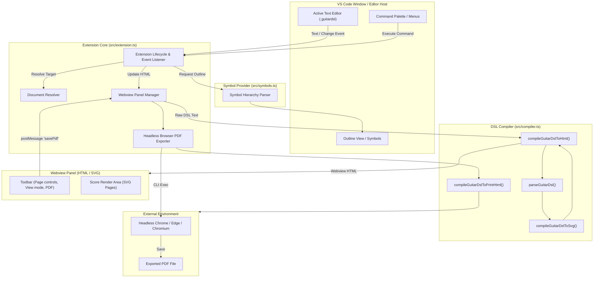
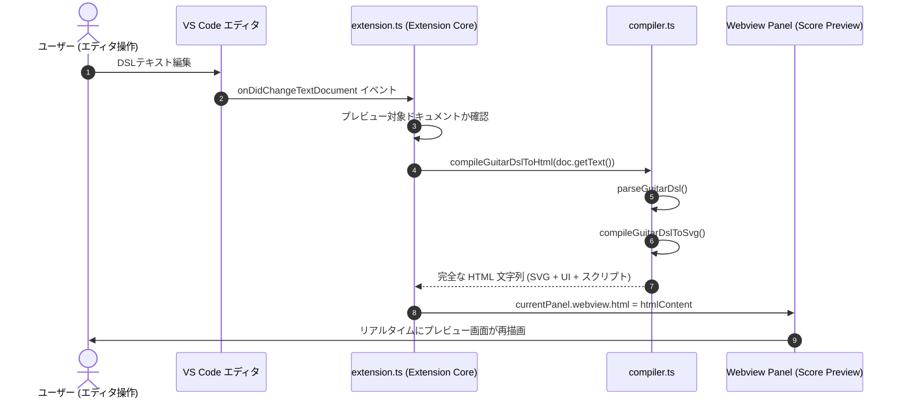
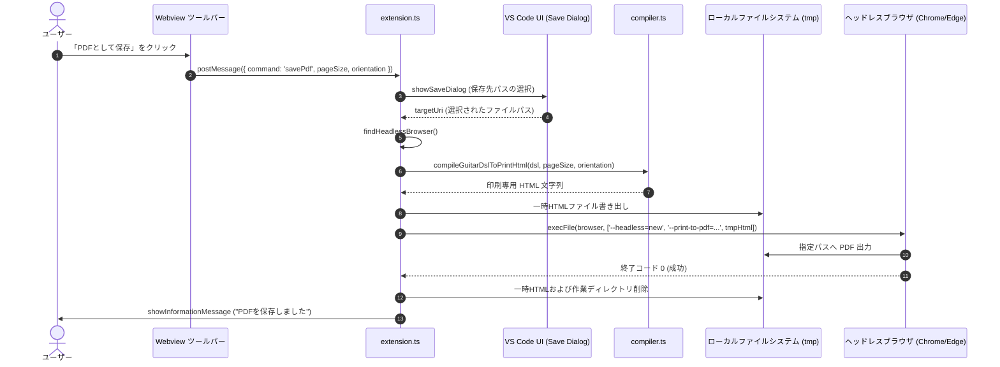

# 内部アーキテクチャ設計書 (Internal Architecture Design)

本書は、Visual Studio Code 拡張機能 **GuitarDSL Previewer** (`vscode-guitar-dsl`) の内部アーキテクチャ、コンポーネント構成、データフロー、および主要アルゴリズムを定義する設計ドキュメントである。

---

## 1. 全体アーキテクチャ概要 (Architecture Overview)

`vscode-guitar-dsl` は、エディタ機能の統合を担う **VS Code Extension Core**、DSLの解析と楽譜SVG/HTMLの生成を担う **GuitarDSL Compiler**、およびVS Codeのアウトライン機能を提供する **Document Symbol Provider** の3つの主要レイヤーから構成される。



---

## 2. コンポーネント構成と責務 (Component Architecture)

### 2.1 Extension Core (`src/extension.ts`)
拡張機能のライフサイクル管理、イベント購読、Webviewパネルの制御、および外部ブラウザによるPDFエクスポートを統括する。

- **エントリポイント**:
  - `activate(context: vscode.ExtensionContext)`: コマンド、イベントリスナー、シンボルプロバイダの登録を行う。
  - `deactivate()`: 拡張機能終了時のリソース解放。
- **WebviewPanel シングルトン管理**:
  - プレビュー表示用パネル（`guitardslPreview`）は多重起動を防ぐため単一インスタンスとして保持。
  - `retainContextWhenHidden: true` を指定し、タブ切り替え時にプレビューのスクロール位置やDOM状態がリセットされるのを防ぐ。
  - パネル破棄イベント（`onDidDispose`）で参照をクリア。
- **ドキュメント解決 (`resolveGuitarDslDocument`)**:
  - コマンド引数の URI、現在のアクティブエディタ、表示中のエディタ群、最後にアクティブだった GuitarDSL ドキュメント、ワークスペース内の開いているファイルの優先順位で対象ドキュメントを安全に解決。
- **イベント駆動同期**:
  - `onDidChangeTextDocument`: テキストが編集された際、現在プレビュー対象のファイルと同一であれば即座に再描画（`compileGuitarDslToHtml`）を実行。
  - `onDidChangeActiveTextEditor`: ユーザが別の `.guitardsl` ファイルをアクティブにした際、プレビューの描画対象を自動追従。
- **PDFエクスポート制御 (`exportScoreToPdf`, `findHeadlessBrowser`)**:
  - OS（macOS, Windows, Linux）に応じた既知の実行可能パス、および `PATH` 環境変数（`which` / `where`）から Chrome / Edge / Chromium / Brave 等のヘッドレスブラウザを検出。
  - 印刷専用HTML（`compileGuitarDslToPrintHtml`）を一時ファイルに出力し、`--headless=new --print-to-pdf` 引数でヘッドレスブラウザを呼び出してPDFを生成。
  - 処理完了後は一時ディレクトリおよびファイルを確実にクリーンアップ（`finally` 節）。

### 2.2 GuitarDSL Compiler (`src/compiler.ts`)
テキストとしてのDSL入力をパースし、楽譜のデータモデルを構築した上で、ベクターSVGおよびスタンドアロンHTMLを出力するコアレンダリングエンジン。

- **データモデル**:
  - `ParsedScore`: パース済みの楽曲全体（メタデータ、使用コード一覧、ページ配列、スタイル情報）。
  - `ScorePage`: ページごとのセクションおよび小節の配列。
  - `MeasureData`: 1小節分のデータ（小節内コード配列 `chords`、反復記号 `repeatStart` / `repeatEnd` / `isMeasureRepeat`、リズム配列 `rhythms`、歌詞 `lyric`、セクション名 `sectionName` 等）。
  - `RhythmItem`: 個々のリズム要素（音価 `duration`、休符フラグ `isRest`、ピッキング `down` / `up`、ゴースト `ghost`、アクセント `accent`、タイ `tie`）。
- **主要パイプライン**:
  1. **パーサー (`parseGuitarDsl`)**:
     - 行単位でテキストを走査。
     - ヘッダー部（`key: value`）から楽曲メタデータおよびスタイル指定を抽出。
     - セクション見出し（`[...]`）および改ページ指示（`pagebreak`）を認識し、ページ構造（`ScorePage`）を分割。
     - 小節行（`|` 区切り）を行分割・トークン分解し、コード、リズム（音価・ピッキング記号・タイ等）、歌詞（`l:"..."`）を構造化。
     - 使用されているコードを自動収集し、コードライブラリ（`CHORD_LIBRARY`）と照合。
  2. **SVG生成 (`compileGuitarDslToSvg`)**:
     - ページ単位でベクターSVGを構築。
     - 五線（Staff Lines）、ト音記号（FETA Treble Clef ベクターパス）、調号・拍子記号の描画。
     - スラッシュノートヘッド、符尾、符桁（ビーム）、タイ弧線の数学的座標計算と描画。
     - 小節反復記号（`%`）および小節線（開始反復、終了反復、複縦線、カッコ番号）の描画。
     - 五線下部への歌詞文字列の均等・同期配置。
  3. **Webview HTMLビルダー (`compileGuitarDslToHtml`)**:
     - SVGページ群を包含するHTMLシェルを構築。
     - ツールバーUI（ページ送り、表示モード切り替え、印刷ダイアログ）とWebview内JavaScriptをバンドル。
  4. **印刷専用HTMLビルダー (`compileGuitarDslToPrintHtml`)**:
     - ツールバーやUIスクリプトを排除し、純粋なSVGページと印刷用CSS（`@page`, `@media print`）のみで構成されるHTMLを出力。

### 2.3 Document Symbol Provider (`src/symbols.ts`)
VS Codeの「アウトライン」機能およびシンボル検索と連携し、DSLドキュメントの構造ツリーを構築する。

- **`GuitarDslDocumentSymbolProvider`**:
  - `vscode.DocumentSymbolProvider` インターフェースを実装。
  - ドキュメントをスキャンし、最上位にメタデータプロパティ（`title`, `artist`, `key`, `bpm` 等: `SymbolKind.Property`）を配置。
  - 各セクション（`[Intro]`, `[Aメロ]` 等）を `SymbolKind.Namespace` として登録し、そのセクション内の小節行の終了行までを行範囲（`range`）として確定。
  - セクション配下の小節行を `formatMeasureSummary` により要約文字列（例: `| C G | Am Em |`）に変換し、子シンボル（`SymbolKind.Field`）として階層的に追加。

### 2.4 TextMate 構文定義 (`syntaxes/guitardsl.tmLanguage.json`)
VS Codeのエディタコアにおけるリアルタイムな字句ハイライトを行う。

- 正規表現による高速なパターンマッチング。
- セクション見出し、メタデータヘッダー、小節線、反復記号、コードネーム、リズムストローク記号、歌詞トークンを標準的なスコープ名へマッピング。

---

## 3. データフローとメッセージング (Data & Event Flow)

### 3.1 リアルタイムプレビュー更新フロー



### 3.2 PDFエクスポートフロー



---

## 4. ページネーションと印刷レイアウト設計 (Pagination & Layout Design)

### 4.1 ページ分割ロジック
- **`pagebreak` 指示子**: DSL内の `pagebreak` 行を検出し、そこで明示的に新規ページ（`ScorePage`）を生成する。
- **ヘッダー描画**: 1ページ目にはタイトル、アーティスト、メタデータ、およびコードダイアグラムを描画し、2ページ目以降は楽曲本文のみを五線レイアウトとして配置。

### 4.2 プレビュー表示モード (View Modes)
Webview内では、CSS Flexbox / Grid およびインラインスタイルを用いて以下の表示モードを提供する。
- **Continuous (連続)**:
  - 全ての `.page` 要素を縦方向にマージンを空けて並べ、通常のスクロールで全ページを閲覧可能にする。
- **Single Page (単一ページ)**:
  - 現在選択されているインデックスの `.page` のみを表示（`display: block`）、他を非表示（`display: none`）にし、ツールバーのページ送りボタンで切り替える。
- **Spread (見開き)**:
  - 2ページずつ横並びで表示（偶数・奇数ページのペアリング）。

### 4.3 印刷用CSS設計 (`@page`, `@media print`)
- 印刷用HTMLでは、以下のスタイルルールによりブラウザの印刷機能と正確に連動する。
  ```css
  @page {
    size: A4 portrait; /* 指定された用紙サイズと向き */
    margin: 0;
  }
  .page {
    page-break-after: always;
    break-after: page;
    width: 210mm;
    height: 297mm;
    box-sizing: border-box;
  }
  ```
- ヘッダー・フッターのURLや日付の自動出力を防止（ブラウザ実行時引数 `--no-pdf-header-footer` の併用）。

---

## 5. エラーハンドリングと堅牢性 (Error Handling & Robustness)

1. **構文エラーの自己回復性**:
   - DSLパーサーは、未知のトークンや構文違反に遭遇しても処理を中断（throw）せず、安全にフォールバック（小節のスキップ、プレースホルダー表示、デフォルト値の適用）を行い、プレビュー描画がクラッシュするのを防ぐ。
2. **ブラウザ非依存性・フォールバック**:
   - PDFエクスポートにおいて、優先順位に従って複数のブラウザパスを探索。見つからない場合も例外でクラッシュさせず、ユーザーに対してわかりやすい警告通知を表示。
3. **一時ファイルの確実な解放**:
   - 一時HTMLファイルおよびユーザーデータディレクトリのクリーンアップは `try ... finally` ブロック内で確実に実行し、異常終了時にもディスクリークを防止。
