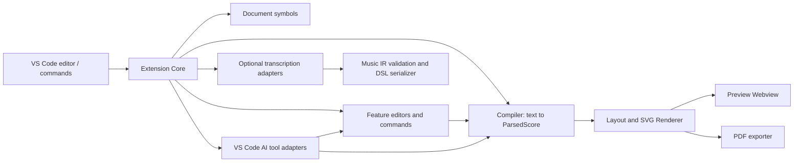

<!-- agent-doc-type: design -->
<!-- agent-doc-schema: 2 -->

# 内部アーキテクチャ設計書 (Internal Architecture Design)

- Status: Draft
- Owning Issue: [Issue #118](https://github.com/puchinya/vscode-guitar-dsl/issues/118)
- Related specification: [Extension specification](../specs/extension.md), [GuitarDSL syntax specification](../specs/guitardsl-syntax.md)

## Context and goals

本書は **vscode-guitar-dsl** のシステム境界、コンポーネント間の依存方向、および機能をまたぐデータフローを説明する。各機能内部の責務やアルゴリズムは、[機能別設計書](README.md)に委譲する。外部動作の正本は[拡張機能仕様](../specs/extension.md)と[言語構文仕様](../specs/guitardsl-syntax.md)であり、本書はそれらを変更しない。

## Requirements traceability

| 責務 | 設計上の所有者 |
|---|---|
| GuitarDSL 構文解析、スコアモデル、演奏順とイベント | [Language and score processing](language-and-score-processing.md) |
| 位置優先ギター TAB のコンパイル済みモデル、意味検証、変換ガード | [TAB notation](tab-notation.md) |
| プレビュー、レンダリング、ページ構成、PDF、再生 | [Preview, rendering, and export](preview-rendering-and-export.md) |
| コード図・楽譜設定・カポ・初心者モード・移調・伴奏編集 | [Score editing](score-editing.md) |
| 音声採譜と結果のDSL化 | [Audio transcription](audio-transcription.md) |
| VS Code の言語機能、コマンド、診断、UI、Help、ローカライズ | [VS Code editor experience](vscode-editor-experience.md) |
| VS Code Agent / Chat 連携 | [AI integration](ai-integration.md) |

## Architecture

拡張機能は VS Code とのライフサイクル、文書解決、コマンド、Webview を `src/extension.ts` を中心とする Extension Core に集約する。GuitarDSL コンパイラーはテキストを `ParsedScore` に変換し、Renderer はその結果からページ SVG やプレビュー HTML を生成する。PDF 出力は Renderer のページ SVG を消費する。コンパイラーは Renderer に依存しない。

```mermaid
flowchart LR
    Editor["VS Code editor / commands"] --> Core["Extension Core"]
    Core --> Compiler["Compiler: text to ParsedScore"]
    Compiler --> Render["Layout and SVG Renderer"]
    Render --> Webview["Preview Webview"]
    Render --> Pdf["PDF exporter"]
    Core --> Symbols["Document symbols"]
    Core --> Editors["Feature editors and commands"]
    Core --> Audio["Optional transcription adapters"]
    Core --> AI["VS Code AI tool adapters"]
    Editors --> Compiler
    Audio --> Serializer["Music IR validation and DSL serializer"]
    AI --> Compiler
    AI --> Editors
```

依存の基本方向は `Extension Core → feature adapters / render / PDF → compiler` である。ドメイン処理のうち純粋な変換は VS Code API から分離し、ホスト側は入出力とエディター統合を担う。採譜の2方式は別の入力アダプターだが、Music IR の検証と DSL シリアライザーを共有する。AI ツールは既存ドメイン API の薄いアダプターであり、モデルの選択・実行は VS Code 側の責務である。

TAB もこの境界に従う。`tab:` の弦・相対フレット・効果は Compiler が `ParsedScore` 内の TAB モデルへ解決し、通常音の実音は `InstrumentModel.pitchAt()` から得る。Renderer はコンパイル済み位置を表示し、調弦・カポから独自に音高を再計算しない。将来の再生・交換形式も同じ TAB モデルを読む。

### Open questions

- 対象 OS と VS Code 最小バージョン以外のデスクトップアプリケーション・プロファイル（アクセシビリティ、配布・更新経路、クラッシュ報告、オフライン要件など）は、既存資料で全項目が確定していない。根拠が揃うまで本書では補完しない。

## Data flow and ownership

| データ | 作成者 | 消費者 / 所有境界 |
|---|---|---|
| GuitarDSL 文書テキスト | VS Code TextDocument | Compiler、symbols、編集機能。保存対象の原文は文書が所有する |
| `ParsedScore` と診断 | Compiler | Renderer、Outline/診断連携、各ドメイン変換 |
| `TabVoiceMeasure` / `TabBeat` / `TabNote` | Compiler と共有 `InstrumentModel` | layout / TAB SVG helper / 安全な変換判定 |
| ページ / SVG / HTML | layout・Renderer | Preview Webview、PDF exporter |
| Music IR (`TranscribedSong`) | 採譜アダプター | validator、serializer、文書挿入フロー |
| AI tool 入出力 | VS Code Agent / Chat と tool adapter | 既存のドメイン API。会話・モデル選択は拡張機能外が所有する |

PDF は `src/pdf.ts` 内でページ SVG からブラウザーを使わずプロセス内生成する。Extension Core は保存先を選び、書き出し成功後にユーザーが完成ファイルを開く操作を担う。PDF 生成経路の詳細は[プレビュー・描画・PDF設計](preview-rendering-and-export.md)を参照する。

各機能固有の制御・状態の流れは[対応する機能設計書](README.md#architecture)に記録する。

## Failure handling

エラーは発生した層で型付き結果、診断、または VS Code のユーザー向けエラー経路として扱う。コンパイル診断、PDF 生成、Webview メッセージ、採譜 API / WASM、編集差分、AI tool の失敗を一つの共通成功値へ丸めない。個別の失敗条件と境界はそれぞれの機能設計書と規範仕様が所有する。

## Alternatives considered

現行資料はレイヤーと責務を示すが、採用しなかった全体アーキテクチャ案と比較根拠を網羅していない。本書では過去の判断理由を推測せず、新たな代替案選択も行わない。機能固有の記録状況は各設計書に明記する。

## Verification strategy

- `python -m agent_workflow validate-docs --issue 118` と `--changed origin/main` で Schema 2 構造、所有 Issue、リンクを確認する。
- `npm run check:help` と `npm run check:ai` で仕様由来の Help / AI 資産の同期を確認する。
- 実装の挙動検証では compiler、render、PDF、playback、採譜、編集、AI の既存ユニット検証を各機能の変更範囲に応じて参照する。今回の文書整理自体は実行時動作を変更しない。
