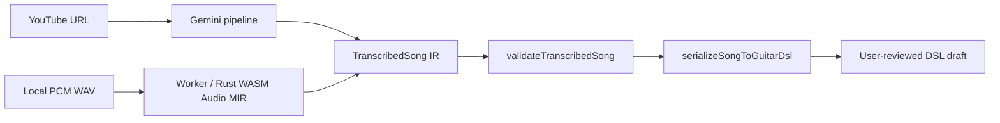

<!-- agent-doc-type: design -->
<!-- agent-doc-schema: 2 -->

# 音声採譜設計 (Audio Transcription)

- Status: Draft
- Owning Issue: [Issue #118](https://github.com/puchinya/vscode-guitar-dsl/issues/118)
- Related specification: [Extension specification](../specs/extension.md), [GuitarDSL syntax specification](../specs/guitardsl-syntax.md)
- System context: [Architecture](architecture.md)

## Context and goals

YouTube 音源の実験的な Gemini 採譜と、ローカル WAV の実験的な Audio MIR を、入力固有の解析経路と共通の Music IR / GuitarDSL 出力経路に分けて記録する。どちらも出力は編集可能な草案であり、規範動作は拡張機能仕様が所有する。

## Requirements traceability

| 仕様上の要件 | 対象 |
|---|---|
| YouTube URL、Gemini 採譜、資格情報、草案出力 | 拡張機能仕様 §3.4–§3.6 |
| ローカル音声採譜、処理境界、キャンセル | 拡張機能仕様 §3.8 |
| melody / syllable lyric 出力形式 | 言語構文仕様 §12–§13 |

## Architecture

- **YouTube**: `src/transcription/` 内で URL 検証、Gemini SDK adapter、応答検証、パイプライン、Webview panel、Music IR 直列化を分離する。Gemini SDK は採譜サブシステム内に隠し、Compiler / Renderer / PDF から独立させる。API key は `ExtensionContext.secrets` に保持する。
- パネルを開く操作だけでは Gemini 呼び出しも文書作成・編集も行わない。ユーザーが実行した後、処理進捗と結果を UI に返す。出力はユーザーが確認・編集できるドラフトである。
- **ローカル Audio MIR**: `wasm/crates/audio-mir/` の Rust/WASM コアと `src/audioMir/` の Worker / host adapter がローカル PCM WAV を扱う。VS Code desktop のローカル extension host を対象とし、web extension / remote extension host は対象外。API key やネットワークを使わない。
- 2つの認識器は推定ロジックを共有せず、検証済み `TranscribedSong` IR と `serializeSongToGuitarDsl` に合流する。音節歌詞の生成・正規化は `src/melody.ts` と `src/transcription/serializer.ts` が担う。

### YouTube pipeline

`runTranscriptionPipeline()` は VS Code 非依存で、次の段階を `onStage` 経由で通知する。ベースライン抽出 → ハーモニー追加入力（IR 形状不正時の限定再要求）→ 必要時だけ曖昧コード検証 → 自動 groove 推定とセクション単位 optimizer、またはユーザー指定 preset の適用 → BPM / capo override → 最終 IR 検証。Gemini SDK adapter は `interactions.create` と構造化 JSON Schema 応答を担当し、続く処理に conversation interaction ID を渡す。生レスポンスや API key はログへ出さない。

Music IR validator は BPM / capo 範囲、コード・音高形式、対応拍子、および各小節の拍数を厳密に検証する。Serializer は入力を黙って音楽的に補修せず、検証済み IR だけから DSL を決定論的に生成する。出力を `parseGuitarDsl()` で再検証し、エラーのない DSL ができてから無題 GuitarDSL 文書を開く。採譜精度を示す承認済み受け入れ閾値は記録されていないため、構造検証は推定音楽内容の正しさを保証しない。

### ローカル Audio MIR pipeline

WAV decoder は PCM 全体を複製保持せず逐次読む。WASM 側は有界 rolling STFT、HPSS、chroma / onset 特徴量、beat / chord / rhythm 推定を順につなぎ、キー推定値は metadata として返す。拡張用の段階 API では `Analysis` が model 入力 log-mel の chunk を公開し、Worker 内の Beat This! WASM model が chunk ごとの logits を返す。残りの特徴量と logits をまとめて最終 JSON を構成し、安定した error code を JS 境界へ返す。

採譜結果は Gemini 経路と共通の `TranscribedSong` JSON 形式へ変換されるが、Audio MIR はローカル推論パイプラインを独立して維持する。評価用の生音声や参照データを配布物に含めないというリポジトリの制約は維持する。

## Data flow and ownership

YouTube adapter は外部サービスの応答を IR に変換し、Audio MIR adapter はローカル推論結果を同じ IR 形式に変換する。IR validator が後続処理への境界を持ち、serializer は有効 IR から DSL を決定論的に生成する。採譜結果は明示的なユーザー操作後にだけ文書へ適用される。

## Failure handling

YouTube URL・API 認証・quota・ネットワーク・応答形式の失敗は採譜エラーとして返し、認証 / quota / network 例外を自動再試行しない。API key や URL をエラー内容へ漏らさない。ローカル解析は Worker/WASM エラーを結果として返し、キャンセル時は処理を止め、文書を作成しない。共通 validator / serializer は不正な IR を出力 DSL に通さない。

## Alternatives considered

既存設計は YouTube Gemini とローカル Audio MIR を別認識器として保ち、共通化を IR 検証・直列化に限定している。統一認識器やクラウド処理への変更は本 Issue の範囲ではなく、過去の比較判断も追加で推測しない。

## Verification strategy

YouTube URL / Gemini adapter / pipeline / serializer、Audio MIR Worker / WASM / IR validator、音節歌詞再解析の既存テストを参照する。今回の文書作業では `validate-docs`、Help 同期、AI 資産同期を検証し、音声処理自体のテストは実行しない。
