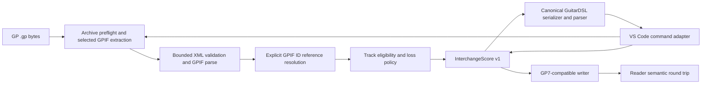

<!-- agent-doc-type: design -->
<!-- agent-doc-schema: 2 -->

# Guitar Pro 7/8 interchange design

- Status: Current
- Owning Issue: [Issue #97](https://github.com/puchinya/vscode-guitar-dsl/issues/97)
- Related specification: [Extension specification §3.15–§3.16](../specs/extension.md)

## Context and goals

This design defines the pure Guitar Pro 7/8 adapter around the public `InterchangeScore` v1 API from [Canonical score interchange](interchange.md). The adapter handles `.gp` files whose embedded GPIF declares GP7 or GP8. It does not use alphaTab, mutate GuitarDSL syntax, or let the VS Code layer interpret GPIF.

The supported musical boundary is one selected six-string guitar track, one staff, and TAB voice 1. The adapter must preserve supported score meaning and must stop when the selected track contains musical meaning it cannot represent. Non-musical sound and layout settings may be omitted only through the typed loss policies owned by the adapter.

The implementation contract and the public behavior are owned by [Issue #97](https://github.com/puchinya/vscode-guitar-dsl/issues/97) and [the extension specification](../specs/extension.md#315-guitardslimportguitarpro). The native source-format evidence uses self-authored files saved by Guitar Pro 8.1.5. At the user's direction, verification in the Guitar Pro 7 application is excluded from acceptance; GP7 import/version handling and GP7-compatible export remain in scope and require automated fixture and self-roundtrip coverage. Guitar Pro 8 native writer open/re-save/reimport remains a required acceptance check.

## Requirements traceability

| Requirement | Design owner |
|---|---|
| `guitardsl.importGuitarPro` and `guitardsl.exportGuitarPro` behavior | [Extension specification §3.15–§3.16](../specs/extension.md) and `src/gp78Commands.ts` |
| GP container validation, selected GPIF extraction, XML parsing, and reference resolution | `src/gp78/archive.ts`, `xml.ts`, and `references.ts` |
| Track eligibility, typed loss handling, import, and export | `tracks.ts`, `compatibility.ts`, `import.ts`, and `export.ts` |
| Canonical interchange and GuitarDSL serialization | `src/interchange/index.ts` only |
| Issue #97 fixture facts and native compatibility evidence | [Compatibility matrix](../status/evidence/issue-97/compatibility-matrix.md) |

## Architecture

The adapter is a pure TypeScript boundary. Its public API is exported from `src/gp78/index.ts`; it has no dependency on VS Code, document URIs, file-system operations, or dialogs.

`inspectGp78(bytes)` validates the container and GPIF version and returns stable track summaries. `importGp78(bytes, selectedTrackId)` converts only the explicitly selected eligible track to `InterchangeScore`. `exportGp78(score)` produces a deterministic `.gp` byte array and accepts it only when the same reader can recover semantically equal interchange data.

The command adapter owns document resolution, workspace file reads, QuickPick and loss confirmation, opening an Untitled document, save-dialog timing, and exclusive local-file publication. It snapshots the source text and document version before export preflight. It must not use temporary Preview transformations.

## Data flow and ownership

### Observed GPIF facts

The compatibility matrix records the exact files and hashes. The current GP8 samples establish these facts:

| GPIF location or value | Observation |
|---|---|
| ZIP `VERSION` and GPIF `GPVersion` | GP8.1.5 files contain `VERSION=7.0` and `GPVersion=8.1.5`; therefore `GPVersion`, not the archive entry, selects the supported family. |
| Archive entry set | Baseline GP8 files include `Content/score.gpif`, `VERSION`, and `meta.json`; the F08 audio fixture also contains its WAV asset. The reader consumes only the GPIF entry and never extracts other entries. |
| Track identity | GPIF track IDs are distinct from the ordering of tracks and are the selection keys. F07 covers an ineligible voice-2 track alongside an explicitly selectable guitar. |
| Meter and bar links | `MasterBar/Time` contains `4/4`; `MasterBar/Bars` contains a Bar ID. `Bar/Voices`, `Voice/Beats`, and `Beat/Notes` contain IDs that must be resolved explicitly. |
| Staff tuning and capo | Staff properties store `CapoFret/Fret` and `Tuning/Pitches`; standard tuning is `40 45 50 55 59 64`, while Drop D is `38 45 50 55 59 64`. F02 also shows `CapoFret=2`. |
| Note position | `Note/Properties` contains `Fret`, `Midi`, and `String`; in F01/F02 the observed string value is `4` and fret is `0`. The UI identifies the note on the B string. |
| Standard-staff accidental | Three notes in the supplied GP8.1.5 sample use `Accidental=x` (double sharp). Since GuitarDSL supports only single accidentals, the reader normalizes to an enharmonic pitch, preserves the sounding pitch, and reports one selected-track spelling loss. |
| Tempo | `MasterTrack/Automations/Automation` carries `Type=Tempo`, `Bar`, `Position`, and `Value`; the sample has bar 0, position 0, and value `120 2`. |
| Repeat | `MasterBar/Repeat` uses `start`, `end`, and `count` attributes; F06 records `true`, `true`, and `2`. |
| Chord reference | GP8 renders beat chord references in CDATA form, for example `<Chord><![CDATA[0]]></Chord>`. F04 covers multiple chord definitions/onsets; F09 has a chord-bearing beat without `Notes` and zero `Note` elements. |
| Empty duration beat | The supplied GP8.1.5 sample has a `Beat` with a valid quarter-note `Rhythm` but no `Notes`, `Rest`, or `Chord`, referenced at the end of two 4/4 measures. It maps to a duration-preserving rest and does not consume a lyric slot. |

These observations establish GP8 reader inputs only for the recorded examples. The implementation must add and document F01–F10 fixture coverage for meter, tempo, key, pickup, chord onsets, techniques, navigation, track/voice policy, loss handling, chord-only, and melody-only behavior. GP7 application verification is excluded; automated GP7 family/version coverage must not be presented as native-app evidence.

### Import

1. `archive.ts` validates the full archive directory before decompression. It rejects malformed bounds, excessive entry counts or declared aggregate sizes, duplicate names, traversal paths, encryption, unsupported compression, and missing or duplicate `Content/score.gpif` entries.
2. Only `Content/score.gpif` is decompressed. The implementation applies the 32 MiB limit to declared and actual output, checks archive size and CRC, and never extracts paths to disk.
3. `xml.ts` rejects DTD, entity declarations, and external entities before parsing. It applies the XML depth and node limits and parses only the validated GPIF payload.
   The XML element limit also bounds the number P of selected-track TAB note positions. Link resolution uses O(P) time and O(P) auxiliary memory; it indexes the next same-string note in a later beat instead of rescanning all positions for each note.
4. `references.ts` builds typed lookup maps and resolves `MasterBar.Bars → Bar.Voices → Voice.Beats → Note/Rhythm` by ID. Duplicate or unresolved IDs are typed errors; IDs are never silently replaced with array positions. A valid duration-bearing Beat with no notes, explicit rest, or chord becomes a rest at that duration and never creates a lyric attack slot. Standard-staff double sharps normalize enharmonically, keep sounding pitch, and add the contracted spelling loss. At the master-bar level, `DoubleBar` maps to `doubleEnd`, `Section/Text` maps to `sectionStart`, and a distinct display `Section/Letter` is reported as one non-blocking loss. `FreeTime` and non-empty `Fermatas` fail with `unsupportedSemantics` because the current IR cannot represent them.
5. `partConfiguration.ts` applies notation flags when the score-view entries that define the selected track agree. A view with no entry for that track does not define its flags. Conflicting flags for that track fail closed; differences on other tracks do not affect interpretation of the selected track. The trailing active-view selector is range-checked but is not trusted to choose notation until its wire semantics are verified against native GP8 evidence. `tracks.ts` summarizes tracks and marks as eligible only a six-string guitar track with one staff and the supported TAB voice. Multiple eligible tracks require an explicit user choice in the command adapter.
6. `compatibility.ts` blocks unsupported music in the selected track. A non-selected track may be reported as `droppedByPolicy` only after the user selects a single track. Known non-musical RSE or display settings can be omitted under named policies. A missing initial tempo may be inferred as 120 BPM with an `inferred` loss entry.
7. `import.ts` builds `InterchangeScore` v1. The command adapter invokes the canonical interchange serializer, reparses the DSL, requires zero errors, reports non-blocking losses, and opens the Untitled document only after approval.

### Export

`export.ts` consumes only `InterchangeScore` v1 and creates one GP7-compatible `.gp` archive. It emits section titles and double-bar markers; unsupported or unrepresentable values, including final-bar markers, fail before output. `exportGp78` runs the generated bytes through the same archive reader, imports the written track, and compares normalized score meaning—including section starts, barline flags, repeat endings, and navigation marks—before returning bytes. This self-check complements the required Guitar Pro 8 native open/re-save check. Guitar Pro 7 native-app verification is excluded by Issue #97's revised contract.

Native writer retesting on 2026-10-10 with Guitar Pro 8.1.5 build 31 is recorded in the [compatibility matrix](../status/evidence/issue-97/compatibility-matrix.md). Every representable fixture output (F01–F07, F08 audio, F09, and F10) opened and displayed, was re-saved by GP8, and re-imported with matching score meaning. Emitting beat chord references as CDATA restored F04 C/G/B labels and diagrams and F09 chord-only display through GP8 re-save. F08 advanced-technique remains a deliberate blocking import case. Guitar Pro 7 native-app verification is excluded and is not a blocker.

The command adapter resolves the current GuitarDSL document, snapshots its text and version, and calls the canonical compiler/interchange API. It does all conversion and loss preflight before showing a save dialog. It refuses overwrite and remote/non-file destinations. For local output it creates a same-directory temporary file with exclusive creation, writes and syncs it, closes it, then publishes with an exclusive hard link. Filesystems without hard-link support fail closed; there is no overwrite or non-atomic fallback.

### Resource and parser boundaries

| Limit | Value |
|---|---:|
| Compressed `.gp` input | 64 MiB |
| ZIP entries | 4,096 |
| Declared aggregate uncompressed size | 128 MiB |
| Extracted GPIF | 32 MiB |
| XML nesting depth | 128 |
| XML nodes | 1,000,000 |

The central-directory preflight is independent of the ZIP decompressor. Selected-entry filtering alone is insufficient: the implementation also checks the directory metadata, accumulated actual output, sizes, and CRC. The XML library must run with entity processing disabled, with a bounded pre-scan rejecting DTD/entity syntax.

## Failure handling

Pure APIs return the contract's discriminated `Gp78Result<T>` with stable error codes: `invalidContainer`, `unsupportedVersion`, `invalidGpif`, `unsupportedSemantics`, `invalidIr`, `unrepresentableValue`, `roundTripMismatch`, and `resourceLimit`. Errors carry a stable code, GPIF path, and detail. VS Code UI text is localized separately and does not alter pure error semantics.

Container failures, invalid XML, invalid GPIF references, unsupported selected-track music, invalid interchange data, and self-round-trip mismatches stop the operation. Non-blocking, named losses are shown before import document creation or export file selection. Cancellation creates no document or output file. Export aborts if the document version changes while the user is choosing a destination. Existing destination bytes remain unchanged under both pre-existing-file and concurrent-creation failures.

No unknown music element, missing reference, invalid numeric value, or malformed field receives a guessed default. Conflicting score-view notation flags for the selected track, free-time bars, and non-empty master-bar fermatas stop import. The only default in v1 is the contract's explicit 120 BPM inference, represented in the loss report.

## Alternatives considered

| Alternative | Decision |
|---|---|
| alphaTab | Excluded by Issue #97. It would replace the requested pure GPIF adapter boundary. |
| Parse the archive `VERSION` entry as the format authority | Rejected by observed GP8 files: `VERSION=7.0` while embedded GPIF declares `8.1.5`. |
| Unpack every ZIP member to disk | Rejected. The reader needs only `Content/score.gpif`; all other entries increase exposure and resource use. |
| Convert directly between GPIF and compiler-private score types | Rejected. The adapter uses the stable `src/interchange/index.ts` boundary so it stays independent of Compiler internals. |
| `fflate` 0.8.3 and `fast-xml-parser` 5.11.2 | Selected by the approved contract, subject to explicit preflight and parser safeguards. Both upstream projects identify MIT licensing. `fflate` 0.8.3 includes the upstream ZIP64 extra-field fix; XML entity processing is disabled and DTD/entity syntax is rejected before parsing. |

## Verification strategy

The native source-format spike is recorded in [the compatibility matrix](../status/evidence/issue-97/compatibility-matrix.md), with self-authored GP8 samples in `tests/fixtures/gp78/`. Unit tests cover archive limits and malformed archives, reference resolution, import/export semantic mapping, loss blocking, and deterministic output. Extension tests cover command registration, explicit multi-track choice, cancellation, loss approval, and safe file publication.

Before merge, run the verification hooks from `.agent/project.json`, `npm run check:help`, `npm run check:ai`, the required unit and extension tests, and the configured delivery checks at the exact PR head. Automated fixtures must exercise all F01–F10 import/export cases, compare semantic roundtrips for representable meaning, and verify contract-defined loss/blocking behavior. The final native gate opens, displays, re-saves, and re-imports writer output in Guitar Pro 8 and compares score meaning. Record GP7 native-app verification as `NOT RUN / EXCLUDED`; it is not a completion blocker.
